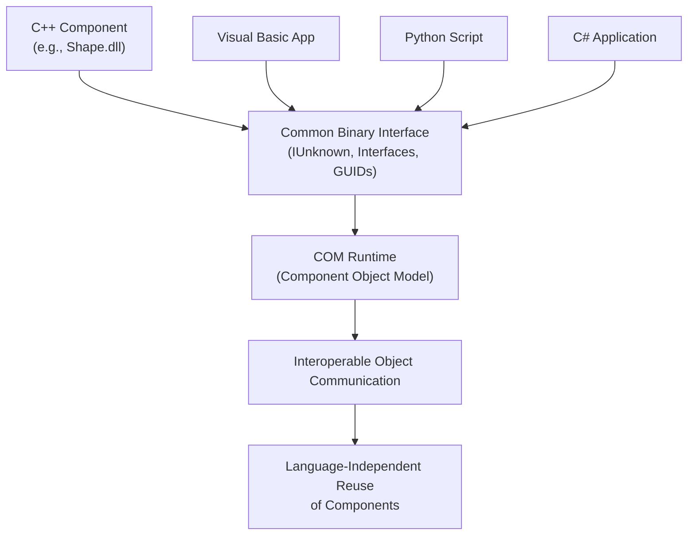
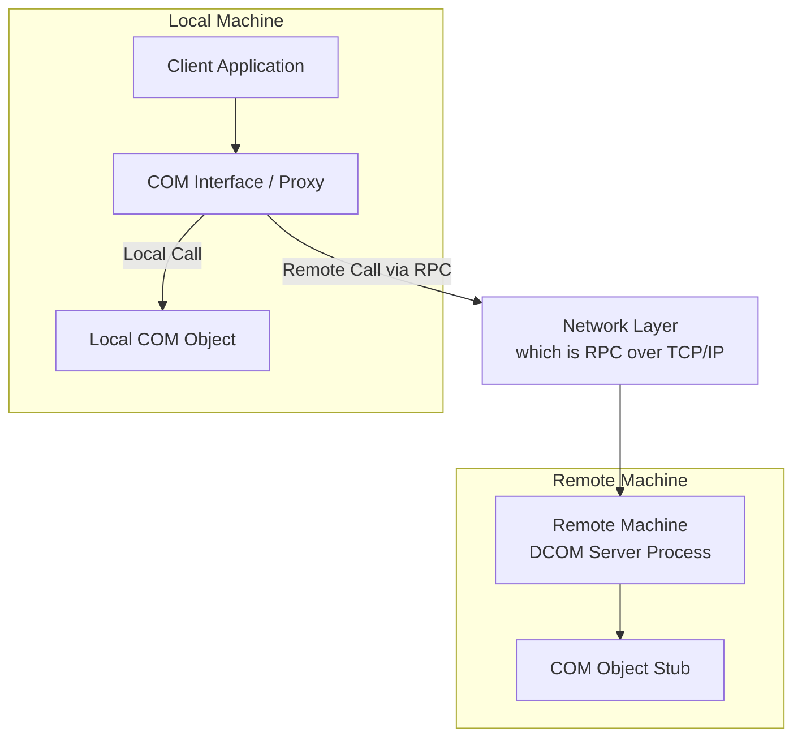
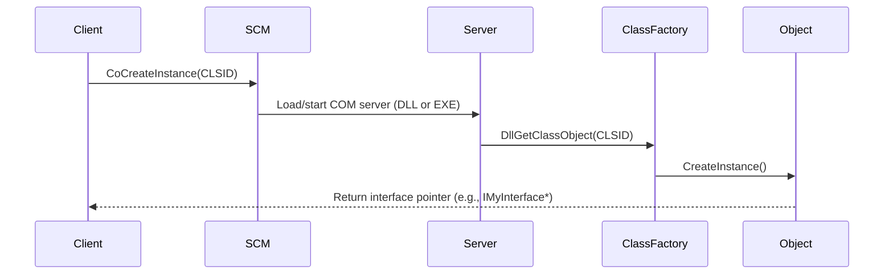
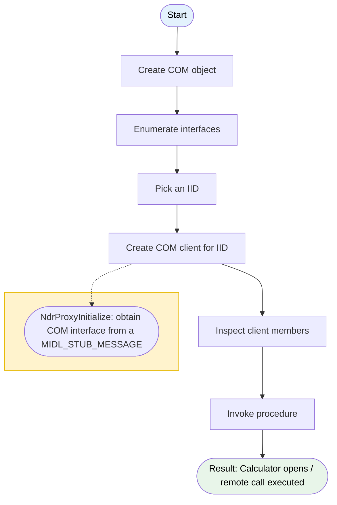
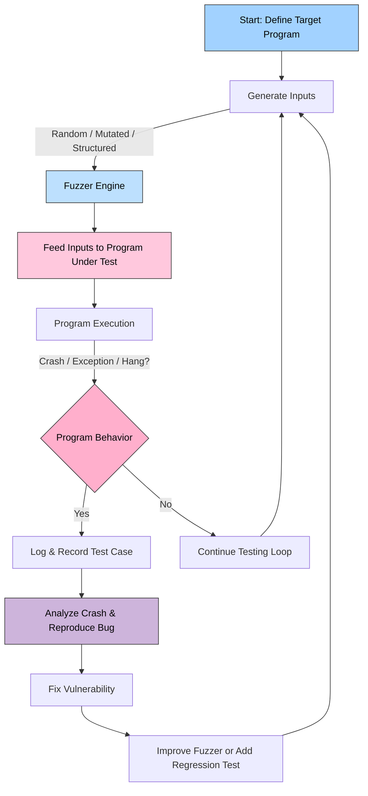
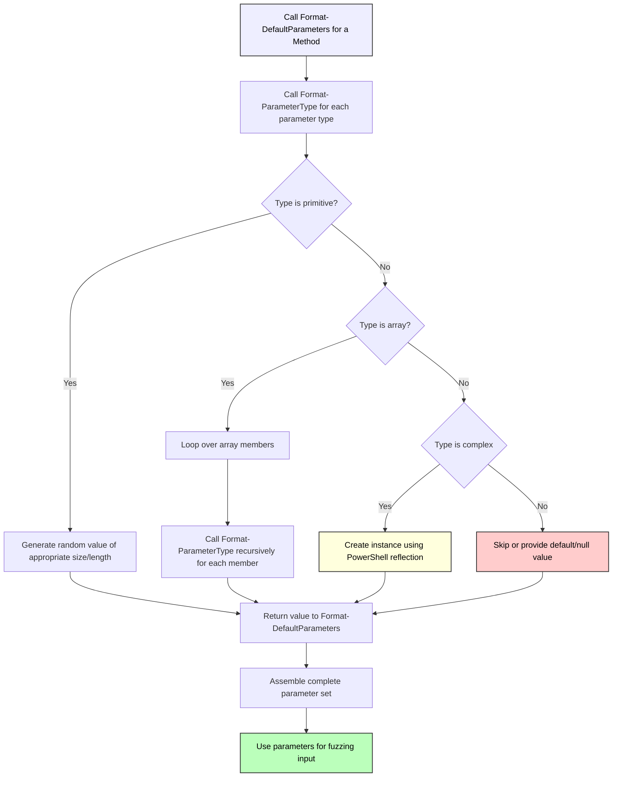
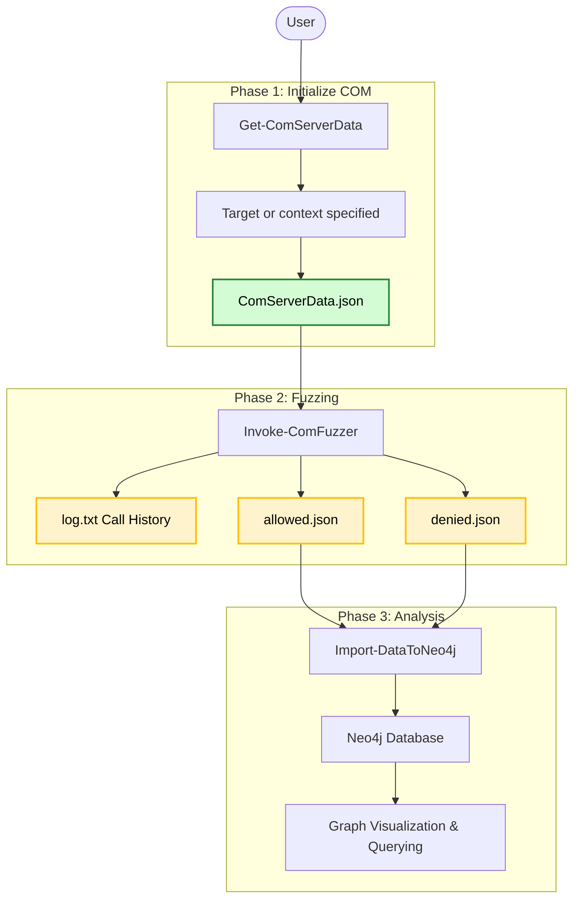

## Introduction
COM (Component Object Model) and DCOM (Distrubuted COM) have been interesting components in Windows from a security perspective for many years. In the past, COM has been a target for many purposes. Not only have many vulnerabilities been discovered in COM, but it is also used for lateral movement or bypassing techniques.

Because of this, many (security) research is already conducted in this area. So to look for new vulnerabilities or techniques, another approach would probably lead to better results (vulnerabilities). I couldn't find any tooling/blogs related to fuzzing COM/DCOM, but correct me if I'm wrong. As fuzzing MS-RPC [was proven to be a successful](https://www.incendium.rocks/posts/Automating-MS-RPC-Vulnerability-Research/) approach to discovering new vulnerabilities, I wondered if the same concept could be applied to COM/DCOM.

I decided to write a fuzzer around the [OleViewDotNet](https://github.com/tyranid/oleviewdotnet) tool from [James Forshaw](https://x.com/tiraniddo). The tool is mainly known for it's GUI (Graphical User Interface). However, it's power really comes with working with the command line options, more on this topic later.

This white paper describes how COM/DCOM works and what complications it has. In the next chapters, the white paper will describe how security research can be automated using the fuzzing approach. Since this approach comes with some problems, it describes how these problems were overcome (at least partially).

The white paper continues to describe what capabilities the COM fuzzer has and discusses some examples. Finally, the white paper will share some results and discuss how the fuzzer can be improved.

> Find the COM-Fuzzer [on GitHub](https://github.com/warpnet/COM-Fuzzer)
{: .prompt-info }

## Chapter 1 | COM explained
Essentially, COM solves a problem for developers. In the early days of Windows, software developers faced a major interoperability. Different applications were written in different languages (C, C++, Visual Basic, etc.). There was no standard way for programs or components to talk to each other or reuse code across applications. Developers often had to recompile or rewrite code just to use it in another program.

COM (Component Object Model) is Microsoft’s technology for building binary software components that can interact with each other, regardless of the programming language they were created in.



### 1.1 Core ideas of COM
COM has a few core ideas that are necessary to get familiar with to understand how COM works. The first one are interfaces.

#### 1.1.1 Interfaces
A COM object exposes functionality through interfaces. Each interface is identified by a GUID (Globally Unique Identifier). COM Clients don’t care how the object is implemented since they just call methods via its interface. The interface ensures that the client and server communicate using the same rules. It uses the Interface Definition Language (IDL) to create an interface. Consider the following example interface:
```c
interface IShape {
    HRESULT Draw();
    HRESULT Resize(int newWidth, int newHeight);
};
```

#### 1.1.2 IUnknown Interface
All COM interfaces inherit from a fundamental base interface called `IUnknown`, which defines three methods:
```c
interface IUnknown {
    HRESULT QueryInterface(REFIID riid, void** ppvObject);
    ULONG AddRef();
    ULONG Release();
};
```
The `QueryInterface` gets pointers to other interfaces and `AddRef`, `Release` manage the object’s lifetime.

#### 1.1.3 COM classes
A COM Class is the actual implementation of one or more interfaces, and it is the blueprint for creating a COM object. It defines the functionality (methods and properties) available in the COM component. Every COM Class is uniquely identified by a Class ID (CLSID), which is a Globally Unique Identifier (GUID).

A client application uses the CLSID to ask the COM runtime (via functions like `CoCreateInstance`) to instantiate an object of that specific class. CLSIDs are registered under the `HKEY_CLASSES_ROOT\CLSID` key in the Windows Registry, pointing to the location of the actual component (DLL or EXE).

```powershell
reg query "HKCR\CLSID\"

HKEY_CLASSES_ROOT\CLSID\CLSID
HKEY_CLASSES_ROOT\CLSID\{0000002F-0000-0000-C000-000000000046}
HKEY_CLASSES_ROOT\CLSID\{00000300-0000-0000-C000-000000000046}
HKEY_CLASSES_ROOT\CLSID\{00000301-A8F2-4877-BA0A-FD2B6645FB94}
HKEY_CLASSES_ROOT\CLSID\{00000303-0000-0000-C000-000000000046}
HKEY_CLASSES_ROOT\CLSID\{00000304-0000-0000-C000-000000000046}
HKEY_CLASSES_ROOT\CLSID\{00000305-0000-0000-C000-000000000046}
HKEY_CLASSES_ROOT\CLSID\{00000306-0000-0000-C000-000000000046}
HKEY_CLASSES_ROOT\CLSID\{00000308-0000-0000-C000-000000000046}
HKEY_CLASSES_ROOT\CLSID\{00000309-0000-0000-C000-000000000046}
[..]
```

#### 1.1.4 ProgID
The ProgID (Programmatic Identifier) is a user-friendly, human-readable string that serves as an alias for a COM Class's CLSID. It provides an easy-to-use name for creating a COM object, often used in scripting languages like VBScript's `CreateObject("ProgID"))`. ProgID's typically follows the pattern: `<Program>.<Component>.<Version>`. Example: `Excel.Application.15`. 

There are also version-independent ProgID's that omit the version, example: `Excel.Application`. ProgIDs are registered under `HKEY_CLASSES_ROOT`, and each ProgID key contains a subkey that maps it back to its corresponding CLSID.

#### 1.1.5 AppID
The AppID is a GUID that uniquely identifies a COM server (the executable or DLL that hosts one or more COM Classes) for configuration purposes. Essentially, it's an identifier that groups multiple related COM classes. 

### 1.2 Distrubuted COM (DCOM)
DCOM builds upon the core COM architecture by adding a network protocol layer, making remote object access feel like local access. DCOM primarily uses [Remote Procedure Call (RPC)](https://en.wikipedia.org/wiki/Microsoft_RPC) over network protocols like TCP/IP to facilitate communication between the client process and the object's server process, which are on separate machines.

Proxies and stubs are used to enable a client on one machine to call a method on an object on another machine. A Proxy object is created on the client machine. The client calls methods on this local proxy object. The proxy packages the method call arguments, sends them across the network using RPC (marshalling), and waits for a response.

The client requests the object's creation using the CLSID or ProgID. The local COM Service Control Manager (SCM) contacts the SCM on the remote machine to locate, authenticate, and launch the COM server process (EXE), which then creates the object.



RPC won't be explained in depth in this white paper. If interested, read [Automating MS-RPC vulnerability research](https://www.incendium.rocks/posts/Automating-MS-RPC-Vulnerability-Research/), which goes into depth about MS-RPC.

### 1.3 From Class to Object
When a COM class is defined, it represents a blueprint for creating COM objects. When a client application wants to use a COM object, it calls a function like `CoCreateInstance`, passing in the CLSID of the class and the interface it needs. This call is handled by the Service Control Manager (SCM), the COM service responsible for locating and activating the appropriate component. 

The SCM checks the registry to determine whether the COM server is local or remote, and whether it runs as a DLL or an executable. If it’s a DLL, the SCM loads it directly into the client’s process. If it’s an EXE, it starts the executable (if not already running) and establishes communication with it.



Using PowerShell reflection, we can create a COM object from a CLSID.
```powershell
$object = [System.Activator]::CreateInstance([type]::GetTypeFromCLSID("da1c0281-456b-4f14-a46d-8ed2e21a866f"))

$object | gm

TypeName: System.__ComObject

Name                      MemberType Definition
----                      ---------- ----------
CreateObjRef              Method     System.Runtime.Remoting.ObjRef CreateObjRef(type requestedType)
Equals                    Method     bool Equals(System.Object obj)
GetHashCode               Method     int GetHashCode()
GetLifetimeService        Method     System.Object GetLifetimeService()
GetType                   Method     type GetType()
InitializeLifetimeService Method     System.Object InitializeLifetimeService()
ToString                  Method     string ToString()
```
## Chapter 2 | OleViewDotNet
Working with COM classes using the registry is quite inconvenient. This is where the tool [OleViewDotNet](https://github.com/tyranid/oleviewdotnet) comes in. This is a .net OLE/COM viewer and inspector to merge functionality of [OleView](https://learn.microsoft.com/en-us/windows/win32/com/ole-com-object-viewer).

It allows you to find COM objects through a number of different views (e.g., by CLSID, by ProgID, by server executable), enumerate interfaces on the object and then create an instance and invoke methods. It also has a basic container to attack ActiveX objects to so you can see the display output while manipulating the data.

The tool comes with a GUI that most people use when researching COM. However, the cmdlets accessible from PowerShell provide far more flexibility from a researching perspective.

### 2.1 COM classes and database
Most of the cmdlets of OleViewDotNet parse a COM database that contains a set of classes. These classes can be gathered using `Get-ComClass`:

```powershell
$classes = Get-ComClass
$classes[0..10]

Name                           CLSID                                DefaultServerName
----                           -----                                -----------------
CLSID_RecordInfo               0000002f-0000-0000-c000-000000000046 oleaut32.dll
StdOleLink                     00000300-0000-0000-c000-000000000046 combase.dll
PSFactoryBuffer                00000301-a8f2-4877-ba0a-fd2b6645fb94 windowscodecs.dll
FileMoniker                    00000303-0000-0000-c000-000000000046 combase.dll
ItemMoniker                    00000304-0000-0000-c000-000000000046 combase.dll
AntiMoniker                    00000305-0000-0000-c000-000000000046 combase.dll
PointerMoniker                 00000306-0000-0000-c000-000000000046 combase.dll
PackagerMoniker                00000308-0000-0000-c000-000000000046 combase.dll
CompositeMoniker               00000309-0000-0000-c000-000000000046 combase.dll
DfMarshal                      0000030b-0000-0000-c000-000000000046 coml2.dll
Picture (Metafile)             00000315-0000-0000-c000-000000000046 combase.dl
```

Here we get the first 10 COM classes that `Get-ComClass` gathered. Now it's going to get annoying if every time you want to look at some COM information you need to run the lengthy Get-ComDatabase command. That's why a simple save and reload feature was implemented. Running the following command will write the current database out to the default database location:

```powershell
Set-ComDatabase -default
```

### 2.2 COM client & invoking procedures
This is where things get more complicated, but it also is the reason the newer features of OleViewDotNet make a solid base for a fuzzer. In order to actually invoke COM procedures, we need a COM client to do so. 

As explained by James Forshaw: The [NdrProxyInitialize](https://learn.microsoft.com/en-us/windows/win32/api/rpcproxy/nf-rpcproxy-ndrproxyinitialize) function can be used to obtain the COM interface from its `MIDL_STUB_MESSAGE` structure by passing in the interface pointer to a proxy. Although this approach is not as flexible as a fully custom implementation, it provides a straightforward way to manage the transport layer without concern for platform or protocol differences. It can also operate with an existing COM object by querying the appropriate interface, extracting the buffer, and making calls to the remote server.

In order to create a COM client for an interface, we first create a new COM object from a CLSID and gather its interface ID's using:
```powershell
$obj = New-ComObject -Clsid 13709620-C279-11CE-A49E-444553540000
Get-ComInterface -Object $obj

Name                 IID                                  HasProxy   HasTypeLib
----                 ---                                  --------   ----------
IUnknown             00000000-0000-0000-c000-000000000046 False      False
IDispatch            00020400-0000-0000-c000-000000000046 True       False
IShellDispatch3      177160ca-bb5a-411c-841d-bd38facdeaa0 True       True
Shell32.IShellDis... 286e6f1b-7113-4355-9562-96b7e9d64c54 False      False
IShellDispatch5      866738b9-6cf2-4de8-8767-f794ebe74f4e True       True
IShellDispatch2      a4c6892c-3ba9-11d2-9dea-00c04fb16162 True       True
IObjectSafety        cb5bdc81-93c1-11cf-8f20-00805f2cd064 True       False
IShellDispatch       d8f015c0-c278-11ce-a49e-444553540000 True       True
IShellDispatch4      efd84b2d-4bcf-4298-be25-eb542a59fbda True       True
IObjectWithSite      fc4801a3-2ba9-11cf-a229-00aa003d7352 True       False
``` 

Next, we pick one of the interface ID's, example `866738b9-6cf2-4de8-8767-f794ebe74f4e` and create the client:

```powershell
$client = Get-ComObjectInterface $obj -Iid 866738b9-6cf2-4de8-8767-f794ebe74f4e
```

Listing the members of the client object reveals its procedures:
```powershell
$client  | Get-Member

TypeName: OleViewDynamicTypes.Shell32.IShellDispatch5

Name                 MemberType Definition
----                 ---------- ----------
[..]
SetTime              Method     void SetTime()
ShellExecute         Method     void ShellExecute(string File, System.Object vArgs, System.Object vDir, System.Object vOperation, System.Object vShow) 
[..]
```

Finally, we can execute the procedure, for example `ShellExecute` using:

```powershell
$client.ShellExecute("calc.exe", $null, $null, $null, $null)
```
And this opens the calculator app.



### 2.3 IDispatch
IDispatch is a fundamental COM interface, that allows scripting languages (VB, PowerShell) and higher-level languages (.NET) to interact with COM objects that implement it without prior knowledge. It achieves this by exposing unified methods that describe and interact with the implementing object. `IDispatch::GetIDsOfNames` maps names of methods or properties to an integer value named DISPID.

Our above example included the IDispatch interface:
```powershell
Get-ComInterface -Object $obj

Name                 IID                                  HasProxy   HasTypeLib
----                 ---                                  --------   ----------
IUnknown             00000000-0000-0000-c000-000000000046 False      False
IDispatch            00020400-0000-0000-c000-000000000046 True       False
[..]
```
This is the reason our COM client was able to map the name of the methods/procedures, like `ShellExecute`. But not every COM class/object includes this interface. Proxies lose name information when compiled from MIDL to their C marshaled representation. Therefore, OleViewDotNet just generates placeholder names, for example, method names are of the form `ProcN`.

```powershell
$obj = New-ComObject -Clsid e9cbf6e2-5441-4414-9ef7-9fb6325e1c28
Get-ComInterface -Object $obj

Name                 IID                                  HasProxy   HasTypeLib
----                 ---                                  --------   ----------
IUnknown             00000000-0000-0000-c000-000000000046 False      False
IMarshal             00000003-0000-0000-c000-000000000046 False      False
IMarshal2            000001cf-0000-0000-c000-000000000046 False      False
IDeviceLanguageMa... 97b82469-ecd2-4bb3-ae0d-e69fc2ffdc8a True       False


$client = Get-ComObjectInterface $obj -Iid 97b82469-ecd2-4bb3-ae0d-e69fc2ffdc8a
$client | gm

TypeName: OleViewDynamicTypes.IDeviceLanguageManager

Name             MemberType Definition
----             ---------- ----------
[..]
Proc3            Method     int Proc3(string p0)
Proc4            Method     int Proc4(string p0, int p1)
Proc5            Method     int Proc5(string p0, int p1, NtApiDotNet.Ndr.Marshal.NdrUnsupported p2)
Proc6            Method     int Proc6(string p0, int p1, int p2, string p3)
```

If the proxy is for a type that has a known definition, such as from a Windows Runtime type or a type library, then OleViewDotNet will try and automatically apply the names. While losing the procedure name context is a bummer, it still allows invoking the procedure and A LOT of classes do not support the IDispatch interface, which means that skipping them would reveal far less interesting results. 

## Chapter 3 | Automating
With the previous chapters in mind and the power of OleViewDotNet, there lies an obvious solution to automating vulnerability research for COM; we loop over all classes it's interfaces, create a COM client for it and invoke the procedures it holds. We feed the input parameters with randomized values and observe the result; fuzzing.

The fuzzing approach by general looks as follows:


Of course this was easier said than done, who would've thought. However, a large part of the [MS-RPC-Fuzzer](https://github.com/warpnet/MS-RPC-Fuzzer) design could be reused for this project! First, we need a way to collect COM class information, the interfaces it holds and the interface it's procedures. Each procedure has a definition with the input parameters it takes, example: `Proc5(string p0, int p1, NtApiDotNet.Ndr.Marshal.NdrUnsupported p2)`.

### 3.1 Parameter formatting
The first problem is parameters and a parameter its input value. This is also the most important factor for the fuzzer, because it will need to contain a value that will hopefully identify interesting COM classes. For fuzzing web applications this is a rather easy step, we can just always send strings. But for COM, there are more parameter types than just strings.

We don't need or even can provide each type with a value. The most essential types for the fuzzing are the primitives (Strings, Integers, etc.) and arrays. We can provide these with random values with different sizes or lengths.

In summary, the COM fuzzer implement two functions: One function `Format-DefaultParameters` will be responsible for extracting all parameters of a Method (procedure) and will call the other function `Format-ParameterType` to provide it a value. 

Some types are "complex" like `NtApiDotNet.Ndr.Marshal.NdrUnsupported` and we cannot provide them a value. However, we will need to provide the procedure the right format parameter type if we want to fuzz it. For example, when a procedure takes a string input parameter and a complex input parameter, we still want to fuzz the string input for that procedure. 

To solve this, we can dynamically create an instance for the parameter using PowerShell reflection:
```powershell
return [System.Activator]::CreateInstance($Type)
```

The "complex" parameter type will most likely be provided with a value that the COM server will reject, because it expects some kind of value. However, this will provide us with the right parameter type so that we can still fuzz the other input parameters like strings.



### 3.2 Collecting COM information
Let's take a step back. Before we can actually start fuzzing, we need to collect the required information to do so. The fuzzer implements a cmdlet `Get-ComServerData` that can collect the COM class information from different input types; whole registry, COM database file, a specific CLSID or a list of CLSID's.

In the following example we tell `Get-ComServerData` to extract the information for the CLSID `13709620-C279-11CE-A49E-444553540000`:

```powershell
Get-ComServerData -CLSID 13709620-C279-11CE-A49E-444553540000 -OutPath .\output\
[+] Processing COM classess... can take a while, check with -Verbose
[+] Exported COM analysis to .\output\
```

The required argument is `OutPath`, which tells the function where to export the results to. This is in the form of a JSON file. The following is a small part of the file that was generated using the above example:

```json
{
  "ClassName": "Shell Automation Service",
  "CLSID": "13709620-c279-11ce-a49e-444553540000",
  "Interfaces": [
    {
      "InterfaceName": "IShellDispatch5",
      "IID": "866738b9-6cf2-4de8-8767-f794ebe74f4e",
      "Methods": [
        "void AddToRecent(System.Object varFile, string bstrCategory)",
        "OleViewDynamicTypes.Shell32.Folder BrowseForFolder(int Hwnd, string Title, int Options, System.Object RootFolder)",
        "System.Object CanStartStopService(string ServiceName)",
        "void CascadeWindows()"
      ]
    },
    {
      "InterfaceName": "IDispatch",
      "IID": "00020400-0000-0000-c000-000000000046",
      "Methods": [
      "int[] GetIDsOfNames(guid riid, string[] rszNames, uint32 cNames, uint32 lcid, int[] dispIDs)",
        "OleViewDynamicTypes.System.Runtime.InteropServices.ComTypes.ITypeInfo GetTypeInfo(uint32 iTypeInfo, uint32 lcid)",
        "uint32 GetTypeInfoCount()",
      "OleViewDynamicTypes.OleViewDotNet.Interop.IDispatch+Invoke_RetVal Invoke(int dispIdMember, guid riid, uint32 lcid, uint16 wFlags, System.Runtime.InteropServices.ComTypes.DISPPARAMS[] pDispParams, System.Runtime.InteropServices.ComTypes.EXCEPINFO pExcepInfo)"
      ]
    }
  ]
}
```
Why exporting it to a JSON file instead of directly fuzzing from the parsed CLSID you may ask. The answer to that is efficiency and time.

#### 3.2.1 Efficiency and time
- Creating an COM object isn't always instant. Sometimes, the system is not able to create a COM object for the parsed CLSID and will error AFTER a timeout of around a minute.
- Some interfaces hold procedures that crash PowerShell, having a JSON file allows you to remove the interface from the file so that the fuzzer won't fuzz that interface.

In general, when the JSON file was created for a COM class, you can always use it to fuzz because nothing will change, which is the case with, for example, RPC endpoints. The COM class may have a different implementation on another version of Windows, or after an update. But in general it should work when copying and pasting it to another system.

#### 3.2.2 Class context and templates
Windows (11) contains a lot of COM classes:

```powershell
$cs = Get-ComClass
$cs | Measure-Object

Count    : 7036
```
While the tool is capable of fuzzing every class, it still would take a lot of time to do so. So it's better to have a specific set of COM classes where to focus on. The tool can filter some classes in different contexts; Remotely accessible classes, classess initiated from services and interactive user COM objects.

For example, we can point the `Get-ComServerData` to collect COM classes initiated from services:

```powershell
Get-ComServerData -OutPath .\output\ -ClassContext remote
```

This is also the reason the COM-fuzzer comes with 3 templates for COM classes that anyone can use to start fuzzing quickly. These are; `remote.json`, `interactive.json` and `services.json`.

#### 3.2.3 COM objects and crashes
For some COM classes there is a bug when creating a COM object, after a specific amount of time, the PowerShell session crashes AFTER already having created the object. So imagine the following scenario; we parse 100 COM classes and COM class on index 18 causes the PowerShell session to crash, but it will do so after some time while the function for collecting the information is already at index 84. One more reason to export the results to a JSON file instead of directly fuzzing.

During my research, I identified some of these classes and hard code blacklisted them in the `Get-ComServerData` function. It could be that there are more COM classes/objects that show this behavior, so be aware of that when using the tooling.

```powershell
foreach ($class in $ComClassTargets) {
    # Define a list of CLSIDs to skip (crashes PowerShell)
    $ExcludedCLSIDs = @(
        "63766597-1825-407d-8752-098f33846f46"
        "bdb57ff2-79b9-4205-9447-f5fe85f37312"
        "577289b6-6e75-11df-86f8-18a905160fe0"
        "581333f6-28db-41be-bc7a-ff201f12f3f6"
    )
[..]
}
```

### 3.3 Input generation and the canary
Let's get back to the fuzzing process. Once we determined the parameter type, the fuzzer provides it with a value, either standalone or within an array. The function `GenerateInput` can be parsed with parameters like minimal string length or minimal integer size. The function takes the parameter type as value and then uses random to generate the input. As an example, the case for a `System.String` parameter type is given:
```powershell
# Initialize new data array
$newData = @()
# Create a function for this that takes parameters for minimum/maximum length of String
if ($paramType -eq "string") {
    if ($NoSpecialChars) {
        $characters = "abcdefghijklmnopqrstuvwxyzABCDEFGHIJKLMNOPQRSTUVWXYZ0123456789"
    } else {
        $characters = "abcdefghijklmnopqrstuvwxyzABCDEFGHIJKLMNOPQRSTUVWXYZ0123456789!@#$%^&*()~-=+?><,;][{}_|"
    }
    $stringLength = Get-Random -Minimum $minStrLen -Maximum $maxStrLen
    $randomString = -join (Get-Random -InputObject $characters.ToCharArray() -Count $stringLength)
    $newData += ($Canary + "_$randomString")
    return $newData
}   
```
You may notice the `$Canary` variable. This is an important deal for the fuzzer to know where our input landed and determine relationships.

The [canary method](https://en.wikipedia.org/wiki/Canary_trap) is used to expose an information leak by giving different versions of a sensitive document of several suspects and seeing which version gets leaked. In our case, for string parameter types, we send a recognizable string and attach a random value to it. Example:
```
mycanary_%iof93Woy3$%d92
```
To find the information leak (know where our input lands in the background), we will need a tool that can monitor processes in the background of the Windows system. The ideal tool for this is [Process Monitor](https://learn.microsoft.com/en-us/sysinternals/downloads/procmon). Process Monitor is an advanced monitoring tool for Windows that shows real-time file system, Registry and process/thread activity.

While having Process Monitor listening in the background, we can start our fuzzer. When we apply a filter in Process Monitor that includes our recognizable part of the string e.g., `mycanary`, we can see where our fuzzing input landed and what kind of function calls are being made with our input.


_Process Monitor with canary as applied filter_

When you know which process ID (PID) is making the request, a next step would be to filter the specific PID and look for further calls it makes. A user can now export the Process Monitor results into a CSV file. The fuzzer provides the `Import-ProcMonCsv` cmdlet to import the data into Neo4j. More about this in a later chapter.

### 3.4 Fuzzing over DCOM
Remotely invoking procedures is also possible (DCOM). Although you will need high privileges to actually invoke the COM call on the remote system, the fuzzer includes an option to do so. Using the `-remoteServer` together with the credentials of the user that is allowed to invoke the COM call, it will fuzz COM on the remote system instead.

Example:
```powershell
'.\output\templates\remote.json' | Invoke-ComFuzzer -RemoteServer 192.168.10.2 -Username cf_admin -Password Password123 -Domain corefusion.com -OutPath .\output\
```

This works by first parsing the user provided arguments to `Get-ComCredential`. This creates a credential object which then gets parsed to `Get-ComAuthInfo`. By default, `Get-ComAuthInfo` uses the following authentication level configuration:
```
AuthnSvc:        WinNT
AuthnLevel:      PKT_PRIVACY
ImpLevel:        IMPERSONATE
Capabilities:    None
```

Which should be fine for most tasks. To figure out if a COM class can be activated and executed remotely, OleViewDotNet's cmdlet `Format-ComSecurityDescriptor` can help:

```powershell
$cs = Get-ComClass -Clsid 01d0a625-782d-4777-8d4e-547e6457fad5
$cs | Format-ComSecurityDescriptor

Name   : CEIPLuaElevationHelper
Type   : Launch/Activate
Control: DaclPresent

Owner
 - Name   : BUILTIN\Administrators
 - Sid    : S-1-5-32-544

Group
 - Name   : BUILTIN\Administrators
 - Sid    : S-1-5-32-544

DACL
 - Type  : Allowed
 - Name  : NT AUTHORITY\SYSTEM
 - Sid   : S-1-5-18
 - Mask  : 0000001F
 - Access: Execute|ExecuteLocal|ExecuteRemote|ActivateLocal|ActivateRemote
 - Flags : None

 - Type  : Allowed
 - Name  : BUILTIN\Administrators
 - Sid   : S-1-5-32-544
 - Mask  : 0000001F
 - Access: Execute|ExecuteLocal|ExecuteRemote|ActivateLocal|ActivateRemote
 - Flags : None

 - Type  : Allowed
 - Name  : NT AUTHORITY\INTERACTIVE
 - Sid   : S-1-5-4
 - Mask  : 0000001F
 - Access: Execute|ExecuteLocal|ExecuteRemote|ActivateLocal|ActivateRemote
 - Flags : None
```

Perfect for discovering new lateral movement techniques ;).

### 3.5 Fuzzing results
While the fuzzer is running, it will store the results into separate JSON files. These are allowed.json and denied.json depending on the returned message. The structure of the result file looks something like:

```json
{
    "d63aa156-d534-4bac-9bf1-55359cf5ec30":  {
      "e10f6c3a-f1ae-4adc-aa9d-2fe65525666e":  [
        {
            "ProcedureName":  "Proc3",
            "ProcedureDefinition":  "int Proc3(string p0, string p1, int p2)",
            "FuzzInput":  "incendium_e[u\u003cvgrdT4m\u0026]O-j{nEbGZq$^_, incendium_Ir_4opDntXlWkfZ\u0026K@Jg-B, 883438441",
            "Output":  "0",
            "WindowsMessage":  "0: The operation completed successfully",
            "Service":  "Profile Notification Host"
        }
      ]
  }
}
```
It stores the input, the output and windows message according to the integer found in the output. But this json file can easily get as big as 50.000 lines. Also, from a JSON structure it is quite hard to see the relations. This calls for a solution that can provide us with tooling that makes analysis easy.

### 3.6 Analysis
The fuzzing results are obtained within standalone JSON files, so a user can do analysis however he likes. Showing the relation between COM class, interface, procedure, input and output is a effective way to get a better understanding about the COM implementation. For this, I chose to reuse the [Neo4j](https://neo4j.com/) wrapper from my MS-RPC-Fuzzer. I rewrote some of the functions to import our JSON files to a (remote) Neo4j database.

The user can provide the JSON file and pipe it to the cmdlet `Import-DataToNeo4j`:
```powershell
'.\output\Allowed.json' | Import-DataToNeo4j -Neo4jHost 192.168.178.89:7474 -Neo4jUsername neo4j
```

### 3.7 Neo4j analysis
To query the data in Neo4j, the Cypher language is used to make the relations. The following Cypher is an example:
```cypher
//GET HIGH PRIVILEGED FILE OPERATION FUNCTION CALLS
MATCH (comClass:ComClass)-[:HAS_INTERFACE]->(comInterface:ComInterface)
MATCH (comInterface)-[:WITH_METHOD]->(method)
MATCH (method)-[:ALLOWS_INPUT]->(allowsinput:AllowsInput)
MATCH (allowsinput)-[:HIGH_PRIVILEGED_FILE_OP]->(highPrivilegedFileOp:HighPrivilegedFileOp)
RETURN comClass, comInterface, method, allowsinput, allowsinput.Endpoint, highPrivilegedFileOp
```
This query looks for high privileged file operation function calls. What does this mean? I wrote a rule that when a high privileged identity, like `NT AUTHORITY\SYSTEM` is making the function call, or it is impersonating this identity, and the function call contains `file`, it will mark it as an `HIGH_PRIVILEGED_FILE_OP` node.

Example output:


_Viewing relationships in Neo4j with high privileged file operations_

Viewing this relationship is only possible because we combined both our fuzzing input and the Process Monitor results into the same Neo4j database. In the above example, a file is being written with our user input provided as `NT AUTHORITY\LOCAL SERVICE`.

To do this, the user should first import the fuzzing results into Neo4j:

```powershell
'.\output\Allowed.json' | Import-DataToNeo4j -Neo4jHost 192.168.178.89:7474 -Neo4jUsername neo4j
```

Next, the user should export the Process Monitor results into a CSV file and import it to Neo4j:

```powershell
"C:\Path\To\My\Export.csv" | Import-ProcMonCsv -canary "mytestcanary" -Neo4jHost 192.168.178.89:7474 -Neo4jUsername neo4j
```

By default, the value for the canary is `incendiumrocks`. But you can change this while fuzzing using the `-Canary` argument with `Invoke-ComFuzzer`. Make sure to change the canary value for `Import-ProcMonCsv` as well if you changed this.

### 3.8 High-level design
In summary; the fuzzer has 3 phashes; inventarize (collecting information), fuzzing and analysis. 



#### 3.8.1 Phase 1: Gather COM classes, interfaces and procedures
First, specify a target to `Get-ComServerData`. This can be the whole registry, a specific CLSID, a list of CLSIDs or a COM database file. This will output a JSON file `ComServerData.json`, containing the classes their CLSIDs, interfaces and procedures, which the user can parse to the fuzzer. If there is no target specified, it will default to the entire registry.

#### 3.8.2 Phase 2: Fuzzing
The fuzzer `Invoke-ComFuzzer`, takes the exported JSON file from the previous phase as required input. The fuzzer will output maximal 2 JSON files and one log file. It will write the COM calls before invoking them to `log.txt`, this way if there is a crash (BSOD), the user will know which call was responsible (last line).

It will separate the fuzz results into 2 JSON files:

1. Allowed fuzzed inputs
2. Fuzzed inputs that lead to Access Denied

#### 3.8.3 Phase 3: Analysis
The user can use the JSON files for analysis as he likes. However, the fuzzer has an option to import them into your Neo4j instance using the `Import-DataToNeo4j` cmdlet. The fuzzer has a data mapper that makes relations for the data, easy as that.

## Chapter 4 | Results
The whole idea is to gain insights into COM/DCOM implementations that may be vulnerable using an automated approach and make it easy to visualize the data. By following this approach, a security researcher will hopefully identify interesting COM classes/implementations in such a time that would take a manual approach significantly more.

While some very interesting COM classes were identified during my research, for now only [CVE-2025-59253](https://msrc.microsoft.com/update-guide/en-US/advisory/CVE-2025-59253) got assigned. This shows that the tool is effective and can be used to discover new vulnerabilities. A big surface has not been properly analyzed. While COM/DCOM can lead to interesting bugs or vulnerabilities, it was never said that it reveals its secrets easily ;) (even with a fuzzing approach).

## Chapter 5 | Conclusion and future work
COM (Component Object Model) and DCOM (Distributed COM) have been interesting components in Windows from a security perspective for many years. Diving into the implementation and internal workings of COM/DCOM was an interesting topic that I had on the planning for quite some time. 

Because of the design of the [MS-RPC-Fuzzer](https://github.com/warpnet/MS-RPC-Fuzzer), a large part of the COM-Fuzzer design could be recycled. While the fuzzer can reveal interesting COM/DCOM implementations, it is still blackbox fuzzing. This means that when we invoke a COM procedure, we are not sure what actually is going to happen. Using external tools such as Process Monitor while fuzzing helps to get a better understanding, but in the end, a researcher will still to reverse the actual implementation to know exactly what is going on. This fuzzer will hopefully identify the COM classes that are worth for further analysis, like reversing the server.

I'm glad the fuzzing approach once again proves that it can be effective on different disciplines, like COM/DCOM, as [CVE-2025-59253](https://msrc.microsoft.com/update-guide/en-US/advisory/CVE-2025-59253) was assigned during my research.

While effective, the tool can be improved in future work. For example, the bug as described in [chapter 3.2.3 COM objects and crashes](#323-com-objects-and-crashes) is something that will probably lead to issues while gathering COM-data for many classes. At some time I plan to filter out more classes that lead to the problem and get to the root cause of this and hopefully fix it/work around it without needing a blacklist.

While fuzzing, the PowerShell session can crash once again. I've tried to identify some of these classes for which this is the case and added them to `blacklist.txt` within the repository. The file can be parsed with the argument `-blacklist`. While this works around the problem, it is again better to get to the root cause of this problem and fix it.

Some procedures take long to finish/execute or even hang. While you can use the argument `-Skip` for this with a specific procedure, it still is annoying. So in the future it will probably be wise to implement a time out. While this is tricky in PowerShell, the requirement to have OleViewDotNet installed beforehand makes this slightly easier (so the module doesn't have to be important each time when working with jobs.)

Finally, new approaches to fuzzing COM/DCOM implementations can be implemented in the future. Things like the `-UNC` path argument or the `-RemoteServer` option can lead to new insights, pherhaps more of these options will be added in the future.

## Resources & References

### Tools & Repositories

- [**OleView.NET (tyranid / James Forshaw)**](https://github.com/tyranid/oleviewdotnet)  
  .NET reimplementation of Microsoft's OLE/COM Object Viewer, useful for inspecting COM type libraries, registered classes, interfaces and typelib metadata when analyzing COM/RPC surfaces.

- [**COM-Fuzzer (Remco van der Meer)**](https://github.com/warpnet/COM-Fuzzer)  
  Fuzzing framework for exercising COM interfaces to discover parsing bugs, memory corruption, and unexpected behaviors in COM servers.

- [**MS-RPC-Fuzzer (Remco van der Meer)**](https://github.com/warpnet/MS-RPC-Fuzzer)  
  Fuzzer specialized for Microsoft RPC (MS-RPC) endpoints and automates generation and delivery of malformed RPC requests for stability and crash analysis.

- [**Procmon (Sysinternals)**](https://learn.microsoft.com/en-us/sysinternals/downloads/procmon)  
  Real-time system activity monitor (file, registry, process/thread), indispensable for observing side-effects of fuzzing, RPC interactions, and runtime behavior on Windows hosts.

- [**Neo4j (graph database)**](https://neo4j.com/)  
  Graph database and visualization platform, commonly used to model interfaces, call graphs and relationships discovered during reverse engineering and protocol analysis.

### Technical Guides & Blogs

- [**Automating MS-RPC Vulnerability Research – Remco van der Meer**](https://www.incendium.rocks/posts/Automating-MS-RPC-Vulnerability-Research/)  
  Practical walkthrough on automating enumeration and testing of MS-RPC surfaces; covers tooling integration, fuzzing strategies, and analysis workflows.

- [**Microsoft RPC – Wikipedia**](https://en.wikipedia.org/wiki/Microsoft_RPC)  
  High-level overview of Microsoft RPC concepts, history and architecture, a good primer before digging into implementation details or tooling.

- [**Canary trap – Wikipedia**](https://en.wikipedia.org/wiki/Canary_trap)  
  Explanation of canary trap techniques for detection/attribution, useful when designing monitored testbeds or leak-detection mechanisms during research.

### Documentation & Specs

- [**OLE/COM Object Viewer — Microsoft Docs**](https://learn.microsoft.com/en-us/windows/win32/com/ole-com-object-viewer)  
  Official documentation for Microsoft's OLE/COM Object Viewer and how to use it to inspect registered COM objects and type libraries.

- [**NdrProxyInitialize (rpcproxy API) — Microsoft Docs**](https://learn.microsoft.com/en-us/windows/win32/api/rpcproxy/nf-rpcproxy-ndrproxyinitialize)  
  API reference for NDR proxy initialization, relevant when working with RPC proxying, custom stubs, or proxy implementations.

- [**CVE-2025-59253 Advisory — MSRC**](https://msrc.microsoft.com/update-guide/en-US/advisory/CVE-2025-59253)  
  Microsoft Security Response Center advisory covering a recent vulnerability; consult for mitigation guidance and technical details if it affects RPC/COM attack surfaces.
