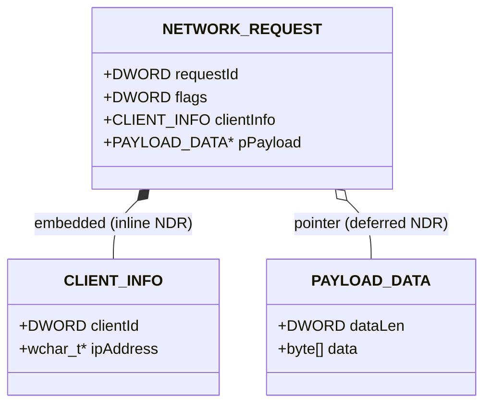

It's been a while since I worked on some updates regarding the [MS-RPC-Fuzzer](https://github.com/warpnet/MS-RPC-Fuzzer). I had two idea's that I wanted to implement and improve:
1. Recursively Fuzzing complex structures
2. Support for Union types (all fields named Arm_N)
3. Logging without the need for ProcMon (Process Monitor) through ETW.

This blog post writes about the implementation for both features and some interesting results that came from these new updates! We discovered a procedure that would load an dll on disk as system by the user provided input.
I assume you are already a bit familair with MS-RPC in this post, if not take a look at [https://www.incendium.rocks/posts/Automating-MS-RPC-Vulnerability-Research/](https://www.incendium.rocks/posts/Automating-MS-RPC-Vulnerability-Research/) and [https://www.incendium.rocks/posts/Revisiting-MS-RPC-Vulnerability-Research-automation/](https://www.incendium.rocks/posts/Revisiting-MS-RPC-Vulnerability-Research-automation/).

## Recursively fuzzing complex structures
In MS-RPC, a structure is a composite data type that groups together multiple fields of potentially different types into a single unit (Integers, Strings, etc), used to pass complex data between a client and server across a remote procedure call.
The existing fuzzer could already populate a flat structure, create an instance via reflection and fill each field with a fuzz value. The challenge with nested structures is that each field might itself be a structure that needs the same treatment, potentially multiple levels deep.

NtObjectManager's generated RPC client types represent the two NDR layouts differently in .NET:

- Embedded fields - exposed as plain value types (structs). `CLIENT_INFO` above would appear as a struct field directly on `NETWORK_REQUEST`.
- Pointer fields - wrapped in the generic `NdrEmbeddedPointer<T>`. `pPayload` above would be a field of type `NdrEmbeddedPointer<PAYLOAD_DATA>`.
 


### New-FuzzedInstance

The solution is built from three cooperating functions. First `New-FuzzedInstance`:

```powershell
function New-FuzzedInstance {
    ...
    $typeName = $Type.FullName
    if ($Depth -gt 8 -or $Visited -contains $typeName) {
        try { return [System.Activator]::CreateInstance($Type) } catch { return $null }
    }
    $Visited = $Visited + $typeName

    $instance = [System.Activator]::CreateInstance($Type)
    $fields   = @($Type.GetFields([System.Reflection.BindingFlags]'Public,Instance'))

    for ($i = 0; $i -lt $fields.Count; $i++) {
        $value = Get-FuzzFieldValue -Type $fields[$i].FieldType ...
        $fields[$i].SetValue($instance, $value)
    }
    return $instance
}
```

For any complex type, New-FuzzedInstance creates a blank instance via `[System.Activator]::CreateInstance`, then iterates every public instance field and calls `Get-FuzzFieldValue` to
produce a fuzz value for it. Two guard rails prevent infinite recursion: a `$Depth` counter (cap at 8) and a `$Visited` set of type names, if a type references itself or has already been visited in the current call chain, it falls back to the blank default instance.

### Get-FuzzFieldValue - the routing layer

```powershell
function Get-FuzzFieldValue {
    ...
    # NdrEmbeddedPointer<T> - must use op_Implicit, not CreateInstance
    if ($Type.IsGenericType -and $Type.Name -like 'NdrEmbeddedPointer*') {
        return New-NdrEmbeddedPointerValue -ClosedPtrType $Type ...
    }

    # Nested complex type - recurse
    if ($Type.IsValueType -or ($Type.IsClass -and -not $Type.IsAbstract)) {
        return New-FuzzedInstance -Type $Type ... -Depth ($Depth + 1) -Visited $Visited
    }
}
```

This function routes each field type to the right handler. Primitives, strings, integers, enums, and byte arrays are handled with direct value generation. When a field is itself a
value type or concrete class (i.e. an embedded structure), `Get-FuzzFieldValue` calls `New-FuzzedInstance` recursively, passing the incremented `$Depth` and the accumulated `$Visited` set.
The `NdrEmbeddedPointer<T>` case is deliberately separated out, it needs special treatment.

### New-NdrEmbeddedPointerValue - handling pointer fields

```powershell
function New-NdrEmbeddedPointerValue {
    ...
    $innerType  = $ClosedPtrType.GetGenericArguments()[0]
    $innerValue = Get-FuzzFieldValue -Type $innerType ... -Depth ($Depth + 1) -Visited $Visited

    $opImplicit = $ClosedPtrType.GetMethod('op_Implicit',
        [System.Reflection.BindingFlags]'Public,Static', $null,
        [System.Type[]]@($innerType), $null)

    if ($opImplicit) {
        return $opImplicit.Invoke($null, @(,$innerValue))
    }
}
```

`NdrEmbeddedPointer<T>` has no parameterless constructor, so `[System.Activator]::CreateInstance` fails. The only supported way to instantiate it is through its implicit cast operator
from `T`. This helper extracts the inner type `T` from the generic argument, fuzzes a value for it (which may itself be another nested structure, handled by the same recursive chain), and then invokes `op_Implicit` via reflection to wrap the fuzzed value in the pointer type.

### Putting it together

For `NETWORK_REQUEST`, the call chain looks like this:

```
New-FuzzedInstance(NETWORK_REQUEST)
├── Get-FuzzFieldValue(DWORD requestId)       → random Int32
├── Get-FuzzFieldValue(DWORD flags)           → random Int32
├── Get-FuzzFieldValue(CLIENT_INFO)           → New-FuzzedInstance(CLIENT_INFO)   [embedded]
│   ├── Get-FuzzFieldValue(DWORD clientId)   → random Int32
│   └── Get-FuzzFieldValue(wchar_t*)         → New-NdrEmbeddedPointerValue(NdrEmbeddedPointer<String>)
│       └── Get-FuzzFieldValue(String)       → fuzz string
└── Get-FuzzFieldValue(NdrEmbeddedPointer<PAYLOAD_DATA>) → New-NdrEmbeddedPointerValue  [pointer]
    └── Get-FuzzFieldValue(PAYLOAD_DATA)     → New-FuzzedInstance(PAYLOAD_DATA)
        ├── Get-FuzzFieldValue(DWORD dataLen) → random Int32
        └── Get-FuzzFieldValue(byte[])        → fuzz byte array
```

The three functions form a mutually recursive loop: `New-FuzzedInstance` calls `Get-FuzzFieldValue` for each field, `Get-FuzzFieldValue` calls back into `New-FuzzedInstance` for embedded
structs and calls `New-NdrEmbeddedPointerValue` for pointer fields, which in turn calls `Get-FuzzFieldValue` on the inner type. Every path through the loop increments `$Depth` and extends
`$Visited`, so the recursion terminates regardless of how deeply structures are nested.

## Support for Union types
In MS-RPC IDL, a union is a type that can hold one of several different data types at the same memory location, with a separate integer discriminant field telling the receiver which
variant is actually present. For example:

```c
typedef union _PAYLOAD_UNION switch(DWORD dataType) {
    case 0: DWORD  simpleValue;
    case 1: WCHAR* stringValue;
    case 2: BLOB   binaryData;
} PAYLOAD_UNION;
```

The current fuzzer didn't yet support Union Types and raises errors like `Exception calling InvokeWithTimeout with 4 argument(s): No matching union selector when marshaling Union_63`.

The union occupies the memory of its largest variant. The discriminant tells the NDR marshaler which arm to serialise/deserialise.
NtObjectManager generates these as .NET structs where each variant becomes a field named Arm_0, Arm_1, Arm_2, each wrapped in `NdrEmbeddedPointer<T>`.

### Two Union Shapes in the Code

`New-FuzzedInstance` handles two ways a union can appear:

Case 1 - the type itself is entirely a union (all fields are Arm_N):
```powershell
$armFields = @($fields | Where-Object { $_.Name -match '^Arm_\d+$' })
if ($armFields.Count -gt 0 -and $armFields.Count -eq $fields.Count) {
    $chosenArm = $armFields[(Get-Random -Maximum $armFields.Count)]
    $ptrValue  = New-NdrEmbeddedPointerValue -ClosedPtrType $chosenArm.FieldType ...
    $chosenArm.SetValue($instance, $ptrValue)
    return $instance
}
```

When the entire type is a union, one arm is picked at random, fuzzed, and set. The other arms are left at their default (zero/null). This is correct, only one arm is ever valid at a
time.

Case 2 - a regular struct contains a Union_N field:

```powershell
if ($ft.Name -match '^Union_\d+$') {
    $unionArmFields = @($ft.GetFields($bindingFlags) | Where-Object { $_.Name -match '^Arm_(\d+)$' })
    $chosenArm = $unionArmFields[(Get-Random -Maximum $unionArmFields.Count)]
    $armIndex  = [int]($chosenArm.Name -replace 'Arm_', '')

    # Set ALL preceding integer-like fields to armIndex (the discriminant)
    for ($j = 0; $j -lt $i; $j++) {
        ...
        $selField.SetValue($instance, [int32]$armIndex)
    }

    # Build the union with the chosen arm populated
    $unionInstance = [System.Activator]::CreateInstance($ft)
    $ptrValue = New-NdrEmbeddedPointerValue -ClosedPtrType $chosenArm.FieldType ...
    $chosenArm.SetValue($unionInstance, $ptrValue)
    $field.SetValue($instance, $unionInstance)
}
```

Here the union is just one field inside a larger struct. The critical extra step is setting the discriminant: the NDR marshaler will refuse to serialise the union if the discriminant
doesn't match the populated arm, it throws `No matching union selector`. The IDL `[switch_is()]` attribute can point to any integer field in the parent struct, not necessarily the one
immediately before the union. Rather than trying to resolve that attribute at runtime, the code takes the conservative approach of setting all preceding integer-like fields to the
chosen arm index. For fuzzing purposes this is safe, worst case an irrelevant field gets an unusual value, which is desirable anyway.

### Why Cached Values Break Unions

This is also why `Test-ContainsUnionField` exists and is called in `Format-SortedParameterType`:

```powershell
$hasUnion = Test-ContainsUnionField -Type $Type
$match = if (-not $hasUnion) {
    # look up cached instance from a previous successful call
}
```

The sorted fuzzer caches complex type instances returned by successful RPC calls to reuse them as inputs to subsequent calls. If a cached instance contains a union, its discriminant
and populated arm were set for the original call. Reusing that instance in a different context risks the discriminant no longer matching, causing the marshaler to fail before the
fuzz value even reaches the server. Types containing unions are therefore always freshly generated with `New-FuzzedInstance` rather than pulled from the cache.

This solution works for most Union Types, which is better than none.

## Replacing Process Monitor with ETW
The fuzzer already had a concept of a canary, a recognisable prefix `incendiumrocks_` prepended to every string and byte array it generates. When the target RPC server touches the
file system or registry using that string, the canary shows up in a Process Monitor trace, revealing which paths the server accesses and under what identity.

The problem with Process Monitor is that it requires a separate GUI tool running alongside the fuzzer. With `SyscallMonitor.cs` and `SyscallMonitor.ps1`, this is now entirely
self-contained in the terminal, provided you run as administrator.

### The ETW Session

Windows exposes kernel file and registry activity through two ETW providers:
```
┌───────────────────────────────────┬──────────────────────────────────────┐
│             Provider              │                 GUID                 │
├───────────────────────────────────┼──────────────────────────────────────┤
│ Microsoft-Windows-Kernel-File     │ EDD08927-9CC4-4E65-B970-C2560FB5C289 │
├───────────────────────────────────┼──────────────────────────────────────┤
│ Microsoft-Windows-Kernel-Registry │ 70EB4F03-C1DE-4F73-A051-33D13D5413BD │
└───────────────────────────────────┴──────────────────────────────────────┘
```

`SyscallMonitor.Start()` opens a real-time ETW trace session via `StartTraceW`, enables both providers with `EnableTraceEx2` at verbose level (all keywords), and spins up a background
thread that calls `ProcessTrace`, which blocks and delivers events to a callback as they arrive.

The entire ETW session lifecycle is managed through manual P/Invoke against `advapi32.dll` and `tdh.dll` rather than the managed `System.Diagnostics.Eventing` API, because the managed
wrappers do not expose the `EVENT_TRACE_MODE_EVENT_RECORD` mode needed to receive raw `EVENT_RECORD` pointers in the callback.

### High-Privilege Alerts

For each matched event the monitor resolves the identity of the process that triggered it by opening its process token, reading `TOKEN_USER`, converting the SID to a string, and
resolving it to a `DOMAIN\User` account name via `LookupAccountSidW`. If the SID matches one of the three high-privilege service accounts `S-1-5-18 SYSTEM`, `S-1-5-19 LOCAL SERVICE`,
`S-1-5-20 NETWORK SERVICE`, the event is additionally enqueued in a separate `_highPrivAlerts` queue.

The fuzzer drains this queue after every RPC invocation via `Show-SyscallAlerts`:

```powershell
function Show-SyscallAlerts {
    $alerts = $script:_SyscallMonitor.TakeAlerts()
    foreach ($a in $alerts) {
        Write-Host "[!] HIGH-PRIV SYSCALL: $($a.RpcProcedure) - $($a.Provider):$($a.Operation): $($a.Path) - $($a.UserName)" -ForegroundColor Red
    }
    Flush-SyscallEvents -OutPath $OutPath
}
```

A real-time alert fires the moment the canary reaches the file system or registry under a privileged identity, directly attributing it to the procedure and endpoint
responsible. 


_Real-time alerting moment canary reaches file system or registry_

All events are also incrementally flushed to `Syscalls.json` and, for high-privilege events only, `HighPrivSyscalls.json`, so results survive even if fuzzing is interrupted
mid-run.

```json
[
  {
    "Timestamp": "2026-05-04 05:19:48.4723253",
    "ProcessId": 3988,
    "ProcessName": "spoolsv.exe",
    "ThreadId": 7476,
    "UserSid": "S-1-5-18",
    "UserName": "NT AUTHORITY\\SYSTEM",
    "Provider": "Registry",
    "Operation": "QueryValueKey",
    "EventId": 7,
    "Path": "incendiumrocks__TE&=#wO@3",
    "PathRewritten": false,
    "RpcServer": "spoolsv.exe",
    "RpcServerPath": "C:\\windows\\system32\\spoolsv.exe",
    "RpcInterface": "12345678-1234-abcd-ef00-0123456789ab",
    "RpcProcedure": "RpcInstallPrinterDriverPackageFromConnection",
    "Endpoint": "ncalrpc:[LRPC-340b3873feba621b77]"
  },
  {
    "Timestamp": "2026-05-04 05:19:48.4723409",
    "ProcessId": 3988,
    "ProcessName": "spoolsv.exe",
    "ThreadId": 7476,
    "UserSid": "S-1-5-18",
    "UserName": "NT AUTHORITY\\SYSTEM",
    "Provider": "Registry",
    "Operation": "QueryValueKey",
    "EventId": 7,
    "Path": "incendiumrocks__TE&=#wO@3",
    "PathRewritten": false,
    "RpcServer": "spoolsv.exe",
    "RpcServerPath": "C:\\windows\\system32\\spoolsv.exe",
    "RpcInterface": "12345678-1234-abcd-ef00-0123456789ab",
    "RpcProcedure": "RpcInstallPrinterDriverPackageFromConnection",
    "Endpoint": "ncalrpc:[LRPC-340b3873feba621b77]"
  }
]
```

### Crash alerts

Service crashes are detected from a completely different signal: the RPC transport itself. When a fuzz call causes the service process behind the RPC server to terminate, the ALPC
channel it was using becomes invalid. The next call returns `NTSTATUS 0xC0000701` (The ALPC message requested is no longer available). The error handler in the fuzzer checks for this
specific status code.


_Real-time alerting moment the RPC server service crashes_

## Replaying interesting calls
As a bonus, I implemented a way to "replay" high privileged calls or crashes using the outputted `Crashes.json` or `HighPrivSyscalls.json`. `Invoke-RpcFuzzer` accepts a `-ReplayFile` parameter. When set, it calls Convert-ReplayFile and substitutes the generated data file and procedure whitelist.


_Replaying procudure call that caused the crash_

This comes in handy when you ran the fuzzer as admin to identify interesting calls but now want to replay them under an less-privleged context. Keep in mind that for ALPC endpoints, these are often user-bound endpoints, so modifying them to the other user's their context is necessary.

## Hey nt authority\system, run my DLL!
As mentioned in the description of this blog post, we found a way to let the system (NT AUTHORITY\SYSTEM) execute our DLL based on our provided input. The only pitfall; the procedure can only be executed by an administrator :P.
While testing the newly implemented features of the fuzzer against the RPC-interfaces in `spoolsv.exe`, I came across the procedure `RpcAddPrintProvidor` which was desperately looking for a DLL to open.

```
[!] HIGH-PRIV SYSCALL: RpcAddPrintProvidor - Registry:CreateKey: incendiumrocks__+V_|%0uP;E - NT AUTHORITY\SYSTEM
[!] HIGH-PRIV SYSCALL: RpcAddPrintProvidor - File:Info : \Device\HarddiskVolume3\WINDOWS\System32\incendiumrocks__hPZWRSMvBl.DLL - NT AUTHORITY\SYSTEM
[!] HIGH-PRIV SYSCALL: RpcAddPrintProvidor - File:Info : \Device\HarddiskVolume3\WINDOWS\SYSTEM32\incendiumrocks__hPZWRSMvBl.DLL - NT AUTHORITY\SYSTEM
[!] HIGH-PRIV SYSCALL: RpcAddPrintProvidor - File:Info : \Device\HarddiskVolume3\WINDOWS\system\incendiumrocks__hPZWRSMvBl.DLL - NT AUTHORITY\SYSTEM
[!] HIGH-PRIV SYSCALL: RpcAddPrintProvidor - File:Info : \Device\HarddiskVolume3\WINDOWS\incendiumrocks__hPZWRSMvBl.DLL - NT AUTHORITY\SYSTEM
[!] HIGH-PRIV SYSCALL: RpcAddPrintProvidor - File:Info : \Device\HarddiskVolume3\WINDOWS\system32\incendiumrocks__hPZWRSMvBl.DLL - NT AUTHORITY\SYSTEM
[!] HIGH-PRIV SYSCALL: RpcAddPrintProvidor - File:Info : \Device\HarddiskVolume3\WINDOWS\system32\incendiumrocks__hPZWRSMvBl.DLL - NT AUTHORITY\SYSTEM
[!] HIGH-PRIV SYSCALL: RpcAddPrintProvidor - File:Info : \Device\HarddiskVolume3\WINDOWS\incendiumrocks__hPZWRSMvBl.DLL - NT AUTHORITY\SYSTEM
[!] HIGH-PRIV SYSCALL: RpcAddPrintProvidor - File:Info : \Device\HarddiskVolume3\WINDOWS\System32\Wbem\incendiumrocks__hPZWRSMvBl.DLL - NT AUTHORITY\SYSTEM
[!] HIGH-PRIV SYSCALL: RpcAddPrintProvidor - File:Info : \Device\HarddiskVolume3\WINDOWS\System32\WindowsPowerShell\v1.0\incendiumrocks__hPZWRSMvBl.DLL - NT AUTHORITY\SYSTEM
[!] HIGH-PRIV SYSCALL: RpcAddPrintProvidor - File:Info : \Device\HarddiskVolume3\WINDOWS\System32\OpenSSH\incendiumrocks__hPZWRSMvBl.DLL - NT AUTHORITY\SYSTEM
[!] HIGH-PRIV SYSCALL: RpcAddPrintProvidor - File:Info : \Device\HarddiskVolume3\Program Files (x86)\Windows Kits\10\Windows Performance Toolkit\incendiumrocks__hPZWRSMvBl.DLL - NT AUTHORITY\SYSTEM
[!] HIGH-PRIV SYSCALL: RpcAddPrintProvidor - File:Info : \Device\HarddiskVolume3\Program Files\Git\cmd\incendiumrocks__hPZWRSMvBl.DLL - NT AUTHORITY\SYSTEM
[!] HIGH-PRIV SYSCALL: RpcAddPrintProvidor - File:Info : \Device\HarddiskVolume3\Users\admin\.local\bin\incendiumrocks__hPZWRSMvBl.DLL - NT AUTHORITY\SYSTEM
[!] HIGH-PRIV SYSCALL: RpcAddPrintProvidor - File:Info : \Device\HarddiskVolume3\Program Files\PowerShell\7\incendiumrocks__hPZWRSMvBl.DLL - NT AUTHORITY\SYSTEM
[!] HIGH-PRIV SYSCALL: RpcAddPrintProvidor - File:Info : \Device\HarddiskVolume3\WINDOWS\system32\config\systemprofile\AppData\Local\Microsoft\WindowsApps\incendiumrocks__hPZWRSMvBl.DLL - NT AUTHORITY\SYSTEM
```

The fuzzer generates random strings, but the procedure `RpcAddPrintProvidor` appended `.DLL` to each of them, which is a indicator that it is looking for a DLL to load. Googling for the procedure to find any documentation also didn't find anything. And I literally mean anything:


_No results for Googling RpcAddPrintProvidor_

The definition of the procedure is as follows:
```csharp
int RpcAddPrintProvidor(string p0, Struct_40 p1)
```

The reason I didn't find this procedure yet, was because of `Struct_40`. We weren't able to fuzz over it yet! It implements a `String` somewhere that parses our input.
The fuzzer accepts the argument `-StringInput` so we can point the string input to a file on disk (my malicious dll). The DLL will execute `whoami` in the context of the user who executes it and writes it to `C:\Windows\Tasks\hello.txt`.


_hello.txt created when pointing RpcAddPrintProvidor to it_

```
PS C:\Users\admin\Documents\MS-RPC-Fuzzer> cat "C:\Windows\Tasks\hello.txt"
nt authority\system
```

Yay! we successfully let `nt authority\system` load our DLL. Obviously the next step was to see whether a low user could call the `RpcAddPrintProvidor`. However, this is not the case. The regular user without administrator rights gets returned access denied.

```json
{
  "spoolsv.exe": {
    "12345678-1234-abcd-ef00-0123456789ab": [
      {
        "MethodName": "RpcAddPrintProvidor",
        "Endpoint": "\\RPC Control\\LRPC-0ea1ebef008050d902",
        "ProcedureName": "RpcAddPrintProvidor",
        "MethodDefinition": "Int32 RpcAddPrintProvidor(System.String, Struct_40)",
        "Service": "Spooler",
        "FuzzInput": "p0=C:\\Windows\\Tasks\\whoami\r\np1=Struct_40 (Complex)",
        "Output": "5",
        "WindowsMessage": "5: Access is denied."
      }
    ]
  }
}
```

The RPC-interface that implements `RpcAddPrintProvidor` also supports `ncacn_ip_tcp` as protocol sequence. This means that you could possibly let the system user load a DLL remotely, if you are admin. Microsoft doesn't see admin -> system as security boundary, which I agree with. It may still be interesting for red teamers to dig deeper into this. And that is the complete goal of the Fuzzer, find interesting procedures!

## Conclusion
This chapter covered three meaningful additions to the MS-RPC Fuzzer: recursive structure fuzzing that handles both embedded and pointer-based nested types, discriminated union
support that keeps the NDR marshaler happy, and an ETW-based syscall monitor that replaces Process Monitor entirely, giving real-time, terminal-visible visibility into where fuzz
input lands in the file system and registry, and under whose identity.

The canary mechanism ties it all together. Every string and byte array the fuzzer generates carries a recognisable prefix. The ETW monitor watches for that prefix in kernel file and
registry events, attributes each hit back to the exact procedure and endpoint that produced it, and immediately alerts when the hit occurs under a high-privilege service account.
Crashes are detected through a separate signal, the ALPC transport collapsing when the service process behind it dies, and are recorded with enough context to replay them in
isolation with `-ReplayFile`.

The value of all this becomes concrete with an actual finding. While testing against the RPC interfaces exposed by spoolsv.exe, the fuzzer flagged `RpcAddPrintProvidor` via a
high-privilege syscall alert: the procedure was reaching into the file system looking for a DLL to load, using a path derived from our fuzz input, under `NT AUTHORITY\SYSTEM`. Looking
closer, the interface implementing `RpcAddPrintProvidor` also registers `ncacn_ip_tcp` as a supported protocol sequence, meaning the call can be made over the network, not just locally.

The constraint is that the procedure requires administrator privileges to call. Microsoft's position is that administrator to SYSTEM is not a security boundary, and that is a
reasonable stance. Still, for a red teamer who already has admin on a box, or is looking for lateral movement paths on a network where they have admin credentials, a procedure that
causes SYSTEM to load an arbitrary DLL over TCP is worth understanding.

That is ultimately what the fuzzer is built to surface: procedures that do something interesting with the input you give them. Finding them is the first step.
